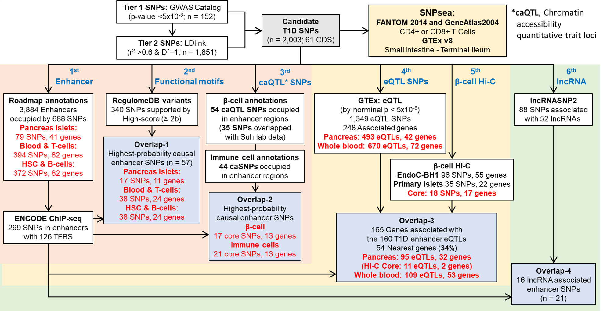
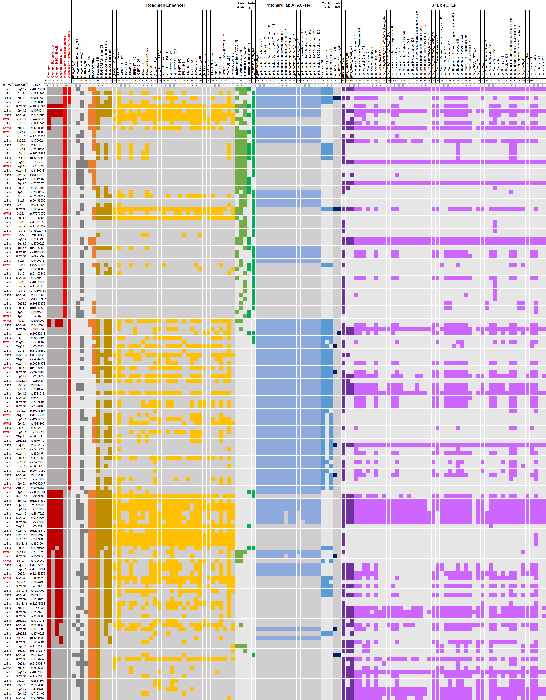
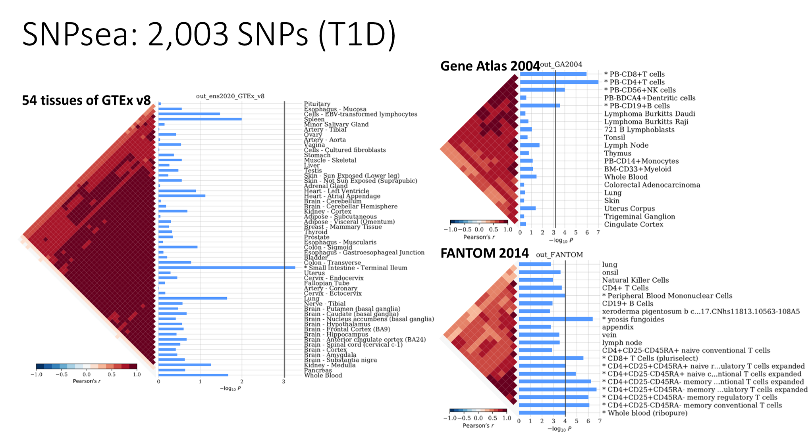

# Post-GWAS analysis: Type 1 Diabetes

This is a log file for analyzing "Type I Diabetes Mellitus" (EFO0001359) from GWAS Catalog.

As of 2020-01-20, the GWAS Catalog contains 4,390 publications and 171,674 associations.
GWAS Catalog data is currently mapped to Genome Assembly GRCh38.p13 and dbSNP Build 153.

And LDlink results are returned with **hg19** coordinates.

## Brief result description










## Additional analysis

* De novo motif: TrawlerWeb [http://trawler.erc.monash.edu.au](http://trawler.erc.monash.edu.au/)
  * Dang et al., 2018, BMC Genomics, [10.1186/s12864-018-4630-0](https://doi.org/10.1186/s12864-018-4630-0)
  * BED format motif list entry (hg19/hg38)
* Core transcriptional Regulatory Circuitries: dbCoRC http://dbcorc.cam-su.org/
  * Huang et al., 2018, Nucleic Acids Res, [10.1093/nar/gkx796](https://dx.doi.org/10.1093%2Fnar%2Fgkx796), pmid [28977473](https://www.ncbi.nlm.nih.gov/pubmed/28977473)
  * Gene symbol list entry (gh19)
* LOLA
  * Need ATAC-seq/Enhancer bed file as input
  * Bioconductor, LOLA: https://bioconductor.org/packages/release/bioc/html/LOLA.html
  * Downlaod LOLA DB files from http://databio.org/regiondb
  * LOLAweb: http://lolaweb.databio.org/
* Hi-C-coupled multimarker analysis tool: H-MAGMA
  * Sey et al., 2020, Nature Neuroscience, [10.1038/s41593-020-0603-0](https://doi.org/10.1038/s41593-020-0603-0)


# 1. From the seed SNPs (EFO0001359) to candidate risk SNPs

## Generating pivot tables

From the downloaded GWAS Catalog data, basic statistics of the trait are need to know. This function will generate three summary pivot tables.

Usage: `Rscript postgwas-exe.r --gwas <options> --base <input file> --out <out folder>`

```CMD
Rscript postgwas-exe.r
	--gwas trait gene study
    --base db_gwas/EFO0001359_2020-02-19.tsv
    --out db_gwas
```

> ** Run function trait_pivot:
> Write TRAITS pivot:     db_gwas/EFO0001359_2020-02-19_snps.tsv
>
> ** Run function gene_pivot:
> Write gene pivot:       db_gwas/EFO0001359_2020-02-19_genes.tsv
>
> ** Run function study_pivot:
> Write study pivot:      db_gwas/EFO0001359_2020-02-19_studies.tsv

## Filtering the GWAS SNPs

Using the downloaded GWAS Catalog file, SNPs are needed to filter by the P-value criteria.

Usage: `Rscript postgwas-exe.r --gwas <option> --base <input file> --out <out folder> --p.criteria <number>`

```CMD
Rscript postgwas-exe.r
	--gwas filter
    --base db_gwas/EFO0001359_2020-02-19.tsv
    --out db_gwas
    --p.criteria 5e-8
```

> ** Run function gwas_filt:
>     gwas dim              = [1] 330  38
>     gwas (5e-08)          = [1] 192  38
> Write gwas filter:      db_gwas/gwas_5e-08_152.tsv


## Downloading LDlink data

To expand the seed SNPs to the neighbor SNPs within the LD block, LS associated SNPs from the seed SNPs are downloaded from the LDlink DB (Machiela et al, 2015, Bioinformatics, pmid 26139635).

Usage: `Rscript postgwas-exe.r --ldlink down --base <input file> --out <out folder> --popul <options>`

```CMD
# Download LD SNPs from 152 query SNPs takes about ~1.2 hrs
Rscript postgwas-exe.r
    --ldlink down
    --base db_gwas/gwas_5e-08_152.tsv
    --out db_gwas/ldlink2
    --popul CEU TSI FIN GBR IBS
```

> ** Run function ldlink_dn... 152.. done
>   Files are moved to target folder: db_gwas/ldlink
> Job done: 2020-02-21 15:05:45 for 1.2 hr
> Warning message:
> package 'LDlinkR' was built under R version 3.6.2

## Filtering the LDlink data

Filtering the LDlink data by the criteria, r<sup>2</sup> > 0.6 and D' = 1.

Usage: `Rscript postgwas-exe.r --ldlink filter --base <input file> <input folder> --out <out folder> --r2d <option>`

```CMD
Rscript postgwas-exe.r
  --ldlink filter
  --base db_gwas/gwas_5e-08_152.tsv db_gwas/ldlink
  --out r2d1_data
  --r2d 1
```

> ** Run function ldlink_filter...
> Read download files... 152
> Error in scan(file = file, what = what, sep = sep, quote = quote, dec = dec,  :
>   line 1 did not have 11 elements
>   [ERROR] rs75793288
>   Read LDlink results           = [1] 303054     12
> Filtering by "r2 > 0.6 and Dprime = 1":
>   Filtered data dimension       = [1] 2147    3
>   Excluded no rsid elements     = [1] 25
> Basic summary of LDlink results:
>   **SNP Tier 1                    = 152**
>   **SNP Tier 2                    = 1851**
>   **SNP candidates                = 2003**
>   SNP source annotation table   = [1] 2003    2
>
> Add annotations:
>   LD block annotation... [1] 139
> Search biomart for SNP coordinates:
>   Query SNPs            = [1] 2003
>   Hg19 result table     = [1] 1992    4
>   Hg38 result table     = [1] 2003    4
>   Cytoband annotation... 2004.. done
>   Merged table          = [1] 2004   11
> Write file: r2d1_data_gwas/gwas_biomart.tsv
> Job done: 2020-03-05 01:41:43 for 20.5 sec

## Generating BED files for coordinates from hg19 and hg38

To prepare candidate SNPs, you have to fill the "NA" coordinate information from the **hg19** and **hg38** columns of the "--ldlink fl" function result file (e.g. `gwas_biomart.tsv`) by searching from the Ensembl biomart. As a note, I found hg19 SNP `rs71080526` have two hg38 SNPs, `rs67544786` and `rs1553647310`. Among those two SNPs, I selected `rs67544786` as same for the Ensemble homepage searching result. And I found the 11 SNPs have no coordinate from the Ensembl, I filled their coordinates from LDlink coordinate information (e.g. ld_coord column). Among the 11 hg19 SNP, `rs78898539` have no hg38 information unfortunately. In total, I found coordinate information of the total 2,003 hg19 SNPs and 2,002 hg38 SNPs. This result was saved as `gwas_snp_2003.bed`.

File name change: `db_gwas/gwas_biomart.bed` -> `db_gwas/gwas_biomart_fill.bed`

For further analysis, you have to generate **BED** format files for both **hg19** and **hg38**.

Usage: `Rscript postgwas-exe.r --ldlink bed --base <input file> <input folder> --out <out folder>`

```CMD
Rscript postgwas-exe.r
    --ldlink bed
    --base r2d1_data/gwas_biomart_fill.tsv
    --out r2d1_data
```

> ** Run function ldlink_bed... [1] 2003    8
> Write file:     r2d1_data_gwas/gwas_hg19_biomart_2003.bed
> Write file:     r2d1_data_gwas/gwas_hg38_biomart_2002.bed
> Job done: 2020-02-25 23:56:09 for 1.9 sec


# 2. Downloading annotation data

## Roadmap download

Downloading the [127 cell type](https://github.com/mdozmorov/genomerunner_web/wiki/Roadmap-cell-types)-specific Roadmap **ChmmModels** BED files (**hg19**) to designated out folder. This process takes about ~35 min depending on your internet speed.

Usage: `Rscript postgwas-exe.r --dbdown roadmap --out <out folder>`

```cmd
# Downloading roadmap data takes ~35 min
Rscript postgwas-exe.r
	--dbdown roadmap
	--out db_gwas/roadmap
```

> ** Run function: db_download.r/roadmap_down...
>   Directory generated: db_gwas/roadmap
> trying URL 'https://egg2.wustl.edu/roadmap/data/byFileType/chromhmmSegmentations/ChmmModels/imputed12marks/jointModel/final/E001_25_imputed12marks_dense.bed.gz'
> Content type 'application/x-gzip' length 8930181 bytes (8.5 MB)
> downloaded 8.5 MB
>
> ...
>
> db_gwas/roadmap/E129_25_imputed12marks_dense.bed.gz
>   Convert: db_gwas/roadmap/E129_25_imputed12marks_dense.bed
>
> File write: db_gwas/roadmap/E129_25_imputed12marks_dense.bed.rds
> Job done: 2020-02-27 16:46:38 for 34.3 min

## ENCODE download

Downloading `wgEncodeRegTfbsClusteredV3.bed.gz` file (81 MB) which is regulatory transcription factor binding site (Reg-TFBS) cluster data from ENCODE.

Usage: `Rscript postgwas-exe.r --dbdown encode --out <out folder>`

```CMD
Rscript postgwas-exe.r
	--dbdown encode
	--out db_gwas/encode
```

> ** Run function: db_download.r/encode_down...
>   Directory generated: db_gwas/encode
> trying URL 'http://hgdownload.cse.ucsc.edu/goldenpath/hg19/encodeDCC/wgEncodeRegTfbsClustered/wgEncodeRegTfbsClusteredV3.bed.gz'
> Content type 'application/x-gzip' length 84986946 bytes (81.0 MB)
> downloaded 81.0 MB
>
> db_gwas/encode/wgEncodeRegTfbsClusteredV3.bed.gz
> Job done: 2020-02-27 17:01:53 for 9.2 sec

## RegulomeDB download

Downloading category scores for SNPs by evidences such as eQTL, TF binding, matched TF motif, matched DNase Footprint, and DNase peak from the RegulomeDB. Default filtering criteria is **score ≥2b**.

Downloading files:

* `RegulomeDB.dbSNP132.Category1.txt.gz` (2 MB)
* `RegulomeDB.dbSNP132.Category2.txt.gz` (39.3 MB)
* (optional) total dataset `RegulomeDB.dbSNP141.txt.gz` (2.8 GB)

Usage: `Rscript postgwas-exe.r --dbdown regulome --out <out folder>`

```CMD
Rscript postgwas-exe.r
	--dbdown regulome
	--out db_gwas/regulome
```

> ** Run function: db_download.r/regulome_down...
>   Directory exists: db_gwas/regulome
>   Download RegulomeDB data
>
> trying URL 'http://legacy.regulomedb.org/downloads/RegulomeDB.dbSNP132.Category1.txt.gz'
> Content type 'application/gzip' length 2096454 bytes (2.0 MB)
> downloaded 2.0 MB
>
> [1] 39432     5
> File write: db_gwas/regulome/dbSNP132.Category1.txt.gz.rds
> trying URL 'http://legacy.regulomedb.org/downloads/RegulomeDB.dbSNP132.Category2.txt.gz'
> Content type 'application/gzip' length 41253483 bytes (39.3 MB)
> downloaded 39.3 MB
>
> [1] 407796      5
> File write: db_gwas/regulome/dbSNP132.Category2.txt.gz.rds
> Job done: 2020-02-27 17:07:17 for 34.7 sec

## GTEx download

GTEx v8 includes 17,382 samples of 54 tissues from 948 donors. See [README_eQTL_v8.txt](https://storage.googleapis.com/gtex_analysis_v8/single_tissue_qtl_data/README_eQTL_v8.txt) for description of GTEx file format.

Usage: `Rscript postgwas-exe.r --dbdown gtex --out <out folder>`

```CMD
# Converting gtex data takes ~1 hr
Rscript postgwas-exe.r
	--dbdown gtex
	--out db_gwas/gtex
```

> ** Run function: db_download.r/gtex_down...
>   Directory exists: db_gwas/gtex
>   Download GTEx data
>
>   db_gwas/gtex/GTEx_Analysis_v8_eQTL.tar
>     File write: db_gwas/gtex/gtex_files.txt
>   db_gwas/gtex/GTEx_Analysis_2017-06-05_v8_lookup_table.txt.gz
>
>   Loading GTEx BED files
>   File reading...
>   (1/49) Adipose_Subcutaneous
>   (2/49) Adipose_Visceral_Omentum
>   ...
>   (48/49) Vagina
>   (49/49) Whole_Blood
>  gte_df.pval_nominal
>  Min.   :0.000e+00
>  1st Qu.:0.000e+00
>  Median :3.168e-07
>  Mean   :2.399e-05
>  3rd Qu.:1.633e-05
>  Max.   :1.759e-03
>   GTEx table, rows= 71478479 cols= 13
>   BED file read complete. Job process: 13.9 min
>   Loading annotation file
>   Annotation file read complete. Job process: 51 min
>   Annotation file, rows= 46569704 cols= 8
>   GTEx annotation, rows= 71478479 cols= 9
>   Saving a compiled RDS file..  db_gwas/gtex/Gtex_Analysis_v8_eQTL_rsid.rds
> Job done: 2020-02-27 19:07:32 for 52.9 min

## lncRNASNP2 download

In lncRNASNP2, 141,353 human lncRNAs and 10,205,295 SNPs were archived.

```CMD
Rscript postgwas-exe.r
	--dbdown lncrna
	--out db_gwas/lncrna
```

> ** Run function: db_download.r/regulome_down...
>   Directory exists: db_gwas/lncrna
> trying URL 'http://bioinfo.life.hust.edu.cn/static/lncRNASNP2/downloads/snps_mod.txt'
> Content type 'text/plain; charset=GBK' length 477785336 bytes (455.7 MB)
> downloaded 455.7 MB
>
> trying URL 'http://bioinfo.life.hust.edu.cn/static/lncRNASNP2/downloads/lncrnas.txt'
> Content type 'text/plain; charset=GBK' length 7005411 bytes (6.7 MB)
> downloaded 6.7 MB
>
> trying URL 'http://bioinfo.life.hust.edu.cn/static/lncRNASNP2/downloads/lncRNA_associated_disease_experiment.txt'
> Content type 'text/plain; charset=GBK' length 31542 bytes (30 KB)
> downloaded 30 KB
>
> [1] 10205295        3
> File write: db_gwas/lncrna/lncRNASNP2_snplist.txt.rds
> [1] 141271      4
> File write: db_gwas/lncrna/lncrnas.txt.rds
> [1] 753   3
> File write: db_gwas/lncrna/lncrna-diseases_experiment.txt.rds
> Job done: 2020-02-27 21:10:59 for 3.2 min

## Ensembl Genes

Downloading Ensembl gene coordinates through biomaRt (hg19)

```CMD
Rscript postgwas-exe.r
	--dbdown gene
	--out db_gwas
	--hg hg19
```

> ** Run function: db_download.r/biomart_gene...
>   BiomaRt table, dim    = [1] 63677     5
>   File write: db_gwas/ensembl_gene_ann_hg19.tsv
>
>   Filtered table, dim   = [1] 57736     5
>   File write: db_gwas/ensembl_gene_hg19.bed
>
> Job done: 2020-02-28 00:38:13 for 6 sec

## Genome information from UCSC table browser

Go to UCSC browser hompage https://genome.ucsc.edu

### Coding exons - hg38

For downloading hg38 coding exons,

1. Go to **Table Browser** page
   * assembly: **hg38**
   * group: Genes and Genes Predictions
   * track: **GENCODE v32**
   * table: knownGene
   * output format: BED - browser extensible data
2. Then click the "**get output**" button. In the new page,
   * visibility= hide
   * Create one BED record per: **Coding Exons**
3. Then download the file by click the "**get BED**" button.
   * Set the file name as `db_gwas/ucsc_tbBrowser_Gencode_v32_CDS_hg38.bed`.

### Coding exons - hg19

For downloading hg19 coding exons:

1. Go to **Table Browser** page
   * assembly: **Feb. 2009 (GRCh37/hg19)**
   * group: Genes and Genes Predictions
   * track: **Ensembl Genes**
   * table: ensGene
   * output format: BED - browser extensible data
2. Then click the "**get output**" button. In the new page,
   * visibility= hide
   * Create one BED record per: **Coding Exons**
3. Then download the file by click the "**get BED**" button.
   * Set the file name as `db_gwas/ucsc_tbBrowser_ensGene_CDS_hg19.bed`.

### Promoter regions - hg19

For downloading hg19 2K proximal promoter regions:

1. Go to **Table Browser** page
   * assembly: **Feb. 2009 (GRCh37/hg19)**
   * group: Genes and Genes Predictions
   * track: **Ensembl Genes**
   * table: ensGene
   * output format: BED - browser extensible data
2. Then click the "**get output**" button. In the new page,
   * visibility= hide
   * Create one BED record per: **Upstream by 2000 bases**
3. Then download the file by click the "**get BED**" button.
   * Set the file name as `db_gwas/ucsc_tbBrowser_ensGene_Up2K_hg19.bed`

### Gene body - hg19

For downloading hg19 gene body regions:

1. Go to **Table Browser** page
   * assembly: **Feb. 2009 (GRCh37/hg19)**
   * group: Genes and Gene Predictions
   * track: **Ensembl Genes**
   * table: ensGene
   * output format: BED - browser extensible data
2. Then click the "**get output**" button. In the new page,
   * visibility= hide
   * Create one BED record per: **Whole Gene**
3. Then download the file by click the "**get BED**" button.
   * Set the file name as `db_gwas/ucsc_tbBrowser_ensGene_wholeGene_hg19.bed`


# 3. Filtering the annotations

## UCSC annotations - Compiling promoter/gene/cds regions

```CMD
Rscript postgwas-exe.r
  --dbfilt ucsc 
  --base db_gwas/ucsc_tbBrowser_ensGene_CDS_hg19.bed db_gwas/ucsc_tbBrowser_ensGene_wholeGene_hg19.bed db_gwas/ucsc_tbBrowser_ensGene_Up2K_hg19.bed
  --out db_gwas
```

> ** Run function: db_filter.r/lncrna_overlap... ready
>   Read CDS file, dim            = [1] 753667      6
>   Read Gene file, dim           = [1] 204940     12
>   Read Promoter file, dim       = [1] 204940      6
>
>   Generate tags... 1.. 2.. 3.. done
>   Compile the three UCSC data... [1] 1163547       4
> Write a BED file: db_gwas/ucsc_annot.bed
> Job done: 2020-03-19 21:23:11 for 1.2 min


## Roadmap filter

### Enhancers

Filtering the Roadmap data by "Enhancers" (e.g., 13_EnhA1, 14_EnhA2, 15_EnhAF, 16_EnhW1, 17_EnhW2, 18_EnhAc). This process might take ~3 min.

The roadmap annotation code information is [here](https://egg2.wustl.edu/roadmap/web_portal/imputed.html).

Usage: `Rscript postgwas-exe.r --dbfilt roadmap --base <base folder> --out <out folder> <...>`

```CMD
Rscript postgwas-exe.r ^
	--dbfilt roadmap ^
	--base db_gwas/roadmap ^
	--out db_gwas ^
	--enh TRUE
```

> ** Run function: db_filter.r/roadmap_filt...
>   Reading files..
>     10/129 being processed.
>     ...
>    Error in gzfile(file, "rb") : cannot open the connection
>    In addition: Warning messages:
>    1: package 'plyr' was built under R version 3.6.2
>    2: package 'data.table' was built under R version 3.6.2
> 3: package 'numbers' was built under R version 3.6.2
> 4: In gzfile(file, "rb") :
> cannot open compressed file 'db_gwas/roadmap/E060_25_imputed12marks_dense.bed.rds', probable reason 'No such file or directory'
> db_gwas/roadmap/E060_25_imputed12marks_dense.bed.rds - file not found.
> Error in gzfile(file, "rb") : cannot open the connection
> In addition: Warning message:
>   In gzfile(file, "rb") :
>   cannot open compressed file 'db_gwas/roadmap/E064_25_imputed12marks_dense.bed.rds', probable reason 'No such file or directory'
> db_gwas/roadmap/E064_25_imputed12marks_dense.bed.rds - file not found.
>  ...
>  120/129 being processed.
>   Finished reading and filtering 129 files.
>   
>    Write file: db_gwas/roadmap_enh.bed
>    Job done: 2020-02-27 23:57:08 for 2.5 min

### Total codes

Total roadmap annotations are achieved by this code.

```CMD
# This step takes a lot of system memomry (~20 GB) and about ~6 min.
Rscript postgwas-exe.r ^
	--dbfilt roadmap ^
	--base db_gwas/roadmap ^
	--out db_gwas ^
	--enh FALSE
```

> ** Run function: db_filter.r/roadmap_filt...
>   Reading files..
>     10/129 being processed.
>     ...
> Error in gzfile(file, "rb") : cannot open the connection
> In addition: Warning message:
> In gzfile(file, "rb") :
>   cannot open compressed file 'db_gwas/roadmap/E060_25_imputed12marks_dense.bed.rds', probable reason 'No such file or directory'
>   db_gwas/roadmap/E060_25_imputed12marks_dense.bed.rds - file not found.
> Error in gzfile(file, "rb") : cannot open the connection
> In addition: Warning message:
> In gzfile(file, "rb") :
>   cannot open compressed file 'db_gwas/roadmap/E064_25_imputed12marks_dense.bed.rds', probable reason 'No such file or directory'
>   db_gwas/roadmap/E064_25_imputed12marks_dense.bed.rds - file not found.
>     ...
>     120/129 being processed.
>   Finished reading and filtering 129 files.
>
> Write file: db_gwas/roadmap_total.bed
> Job done: 2020-02-28 12:00:35 for 5.7 min

### Enhancer in each cell type with metadata

To identify cell type-specific enhancers, filtering the enhancer tags by each cell type. See details in `db_gwas/roadmap_metadata.tsv`:

* Original data at Roadmap homepage: https://egg2.wustl.edu/roadmap/web_portal/meta.html
* Google doc: https://docs.google.com/spreadsheets/u/0/d/1yikGx4MsO9Ei36b64yOy9Vb6oPC5IBGlFbYEt-N6gOM/edit?usp=sharing#gid=15
* mdozmorov's Github: https://github.com/mdozmorov/genomerunner_web/wiki/Roadmap-cell-types

```CMD
Rscript postgwas-exe.r
	--dbfilt roadmap
	--base db_gwas/roadmap
	--out  db_gwas/roadmap_enh
	--enh  TRUE
	--sep  TRUE
```

> ** Run function: db_filter.r/roadmap_filt...
>   Directory generated: db_gwas/roadmap_enh
>   Reading files..
>     10/129 being processed.
>     ...
> Error in gzfile(file, "rb") : cannot open the connection
> In addition: Warning message:
> In gzfile(file, "rb") :
>   cannot open compressed file 'db_gwas/roadmap/E060_25_imputed12marks_dense.bed.rds', probable reason 'No such file or directory'
>   db_gwas/roadmap/E060_25_imputed12marks_dense.bed.rds - file not found.
> Error in gzfile(file, "rb") : cannot open the connection
> In addition: Warning message:
> In gzfile(file, "rb") :
>   cannot open compressed file 'db_gwas/roadmap/E064_25_imputed12marks_dense.bed.rds', probable reason 'No such file or directory'
>   db_gwas/roadmap/E064_25_imputed12marks_dense.bed.rds - file not found.
>     ...
>     120/129 being processed.
>   Finished processing 129 files.
>
> Job done: 2020-03-03 22:04:51 for 3.1 min

## GTEx filter

Filtering GTEx eQTL data by p-value <5e-8.

```CMD
Rscript postgwas-exe.r ^
	--dbfilt gtex ^
	--base db_gwas/gtex/Gtex_Analysis_v8_eQTL_rsid.rds ^
	--out db_gwas
	--pval 5e-8
```

> ** Run function: db_filter.r/gtex_filt...
>   P-value threshold     = [1] 5e-08
>   GTEx data, dim        = [1] 71478479        9
>  gtex_sig.pval_nominal
>  Min.   :0.000e+00
>  1st Qu.:0.000e+00
>  Median :8.100e-13
>  Mean   :3.518e-09
>  3rd Qu.:9.148e-10
>  Max.   :5.000e-08
>   GTEx <5e-08, dim      =[1] 30613850        9
> Write file: db_gwas/gtex_signif_5e-08.rds
> Job done: 2020-02-28 00:15:35 for 2.9 min

## Converting Stitzel lab's Hi-C data

To analyze physical interaction map between SNPs to Genes, Stitzel lab's Hi-C data was converted to BED format.

```CMD
Rscript postgwas-exe.r
  --dbfilt hic_bed
  --base db_1b_Stitzellab/GSE118588_RAW/GSM3333916_EndoC_BH1_HiC_HiCCUPS_loops.txt db_1b_Stitzellab/GSE118588_RAW/GSM3333898_Human_Islet_HiC_HiCCUPS_loops.txt
  --out db_1b_Stitzellab
```

> ** Run function: db_filter.r/hic_bed... ready
> Total 2 file(s) is/are input.
>
>   1     GSM3333916_EndoC_BH1_HiC_HiCCUPS_loops.txt      [1] 9100   20
>   Write file: db_1b_Stitzellab/GSM3333916_EndoC_BH1_HiC_HiCCUPS_loops.bed
>
>   2     GSM3333898_Human_Islet_HiC_HiCCUPS_loops.txt    [1] 2580   20
>   Write file: db_1b_Stitzellab/GSM3333898_Human_Islet_HiC_HiCCUPS_loops.bed
> Job done: 2020-03-21 02:27:33 for 12 sec


# 4. Distances from the annotations

## For General annotations

Using `bedtools closest` in bash, this process required a lot of resouce (e.g., ~19GB of RAM). Therefore, files were moved to AWS to BNL server which is highly secured. Then I ran the bellow processes:

```bash
bedtools sort -i db/roadmap_enh.bed | bedtools closest -d -a gwas_hg19_biomart_2003.bed -b stdin > data/roadmap_enh.tsv # Error: std::bad_alloc <- memory shortage error
```

```bash
#bedtools sort -i db/roadmap_total.bed | bedtools closest -d -a gwas_hg19_biomart_2003.bed -b stdin > data/roadmap_total.tsv
```

```bash
#./bin/bedtools sort -i 2020_t1d/db/roadmap_087_enh.bed | ./bin/bedtools closest -d -a 2020_t1d/gwas_hg19_biomart_2003.bed -b stdin > 2020_t1d/data/roadmap_087_enh.tsv
```

```bash
bedtools sort -i db/wgEncodeRegTfbsClusteredV3.bed | bedtools closest -d -a gwas_hg19_biomart_2003.bed -b stdin > data/encode_tfbs.tsv
```

```bash
bedtools sort -i db/ensembl_gene_hg19.bed | bedtools closest -d -a gwas_hg19_biomart_2003.bed -b stdin > data/ensGene_hg19.tsv
```

```bash
bedtools sort -i db/ucsc_tbBrowser_ensGene_CDS_hg19.bed | bedtools closest -d -a gwas_hg19_biomart_2003.bed -b stdin > data/ensGene_cds_hg19.tsv
```

Then result files were downloaded from the BNL server to AWS EC2 to local `data_gwas/distance/` folder.

```bash
bedtools sort -i db/ucsc_annot.bed | bedtools closest -d -a gwas_hg19_biomart_2003.bed -b stdin	> data/ucsc_annot.tsv
```


## For roadmap each cell type

Full code was wrote in `db_gwas/roadmap_dist.sh`:

```bash
bedtools sort -i roadmap_enh/roadmap_001_enh.bed | bedtools closest -d -a gwas_hg19_biomart_2003.bed -b stdin > roadmap_dist/roadmap_001_enh.tsv
bedtools sort -i roadmap_enh/roadmap_002_enh.bed | bedtools closest -d -a gwas_hg19_biomart_2003.bed -b stdin > roadmap_dist/roadmap_002_enh.tsv
...
bedtools sort -i roadmap_enh/roadmap_002_enh.bed | bedtools closest -d -a gwas_hg19_biomart_2003.bed -b stdin > roadmap_dist/roadmap_002_enh.tsv
```

## Preparing β-cell ATAC-seq data

### Distance of Meltonlab's β-cell ATAC-seq data

See details in `db_Meltonlab/README.md` file. Original download files are in `db_Meltonlab/UCSC/` folder.

GEO access: https://www.ncbi.nlm.nih.gov/geo/query/acc.cgi?acc=GSE139817

peaks.bed file (mapped on **hg19**) list:

* GSM4171638_SCbeta_ATAC_rep1.peaks.bed
* GSM4171640_Beta_ATAC_rep1.peaks.bed
* GSM4171642_in_vivo-matured_SCbeta_ATAC_rep1.peaks.bed
* GSM4171643_in_vivo-matured_SCbeta_ATAC_rep2.peaks.bed
* GSM4171644_in_vitro-matured_SCbeta_ATAC_12h.peaks.bed
* GSM4171645_in_vitro-matured_SCbeta_ATAC_72h.peaks.bed

Using `bedtools closest` in bash:

```bash
bedtools closest -d
	-a gwas_hg19_biomart_2003.bed
	-b db/GSM4171638_SCbeta_ATAC_rep1.peaks.bed
	> data/SCbeta_ATAC.tsv
```

```bash
bedtools closest -d
	-a gwas_hg19_biomart_2003.bed
	-b db/GSM4171640_Beta_ATAC_rep1.peaks.bed
	> data/Beta_ATAC.tsv
```

```bash
bedtools closest -d
	-a gwas_hg19_biomart_2003.bed
	-b db/GSM4171642_in_vivo-matured_SCbeta_ATAC_rep1.peaks.bed
	> data/SCbeta_in_vivo_ATAC_rep1.tsv
```

```bash
bedtools closest -d
	-a gwas_hg19_biomart_2003.bed
	-b db/GSM4171643_in_vivo-matured_SCbeta_ATAC_rep2.peaks.bed
	> data/SCbeta_in_vivo_ATAC_rep2.tsv
```

```bash
bedtools closest -d
	-a gwas_hg19_biomart_2003.bed
	-b db/GSM4171644_in_vitro-matured_SCbeta_ATAC_12h.peaks.bed
	> data/SCbeta_12h_ATAC.tsv
```

```bash
bedtools closest -d
	-a gwas_hg19_biomart_2003.bed
	-b db/GSM4171645_in_vitro-matured_SCbeta_ATAC_72h.peaks.bed
	> data/SCbeta_72h_ATAC.tsv
```

### Distance of Meltonlab each cell type data

Full code was wrote in `db_gwas/meltonlab_dist.sh`:

```bash
bedtools sort -i ./meltonlab/GSM4171636_PP2_ATAC_rep1.peaks.bed | bedtools closest -d -a gwas_hg19_biomart_2003.bed -b stdin > ./meltonlab_dist/PP2_ATAC_rep1.tsv
bedtools sort -i ./meltonlab/GSM4171637_EN_ATAC_rep1.peaks.bed | bedtools closest -d -a gwas_hg19_biomart_2003.bed -b stdin > ./meltonlab_dist/EN_ATAC_rep1.tsv
...
bedtools sort -i ./meltonlab/GSE140500_SCbeta_TE.byH3K27ac.bed | bedtools closest -d -a gwas_hg19_biomart_2003.bed -b stdin > ./meltonlab_dist/SCbeta_TE_enh.tsv
```

### Preparing Yizhou's β-cell ATAC-seq data

This result data mapped on **hg19** version. See details in `db_Yizhou/README.md` file. Using `bedtools intersect`:

```bash
bedtools intersect -u
	-a YY005-beta-cell-1_R1.nodup.tn5.pr1_pooled.pf_peaks.bed
	-b YY005-beta-cell-1_R1.nodup.tn5.pr2_pooled.pf_peaks.bed
	> YY005-beta-cell-1_R1.nodup.tn5.pr1_pooled_pseudo_over.bed
```

`YY005-beta-cell-1_R1.nodup.tn5.pr1_pooled_pseudo_over.bed` file has pseudo_pooled pr1 data overlapped with pr2 data. And `YY005-beta-cell-1_R1.nodup.tn5_pooled.pf_peaks.bed` file has union peaks from the four samples.

Here, we used the background corrected (peudo) and union (pooled) pr1 peaks overlapped with pr2 peaks.

### Distance of Yizhou's β-cell ATAC-seq data

Using `bedtools closest`:

```bash
bedtools closest -d
	-a gwas_hg19_biomart_2003.bed
	-b db/YY005-beta-cell-1_R1.nodup.tn5.pr1_pooled_pseudo_over.bed
	> data/SCbeta_YZ_pseudo_pool_ATAC.tsv
```

### For Stitzel lab's EndoC-βH1 cell

#### ATAC-seq data

```bash
bedtools sort -i	./1b_stitzellab/GSM3333912_EndoC_BH1_ATACseq_broadPeak.fdr0.05.noBlacklist.bed |	bedtools closest -d	-a	gwas_hg19_biomart_2003.bed -b stdin >	./1b_stitzellab_dist/EndoC_BH1_ATAC_broadPeak.tsv
```

#### ChromHmm annotation

```bash
bedtools sort -i 1b_stitzellab/GSE118588_EndoC_BH1_ChromHMM_annotations.bed | bedtools closest -d -a gwas_hg19_biomart_2003.bed -b stdin > 1b_stitzellab_dist/EndoC_BH1_ChromHMM.tsv
```

#### Hi-C data

I ran this code at local PC.

**For GWAS SNPs**

```bash
bedtools sort -i db_1b_Stitzellab/GSM3333898_Human_Islet_HiC_HiCCUPS_loops.bed | bedtools closest -d -a r2d1_data/gwas_hg19_biomart_2003.bed -b stdin > r2d1_data/1b_stitzellab_hic/Primary_Islet_HiC_gwas.tsv

bedtools sort -i db_1b_Stitzellab/GSM3333916_EndoC_BH1_HiC_HiCCUPS_loops.bed | bedtools closest -d -a r2d1_data/gwas_hg19_biomart_2003.bed -b stdin > r2d1_data/1b_stitzellab_hic/EndoC_BH1_HiC_gwas.tsv
```

**For UCSC annotations** 

```bash
bedtools sort -i db_gwas/ucsc_annot.bed > db_gwas/ucsc_annot_sort.bed

bedtools sort -i db_1b_Stitzellab/GSM3333898_Human_Islet_HiC_HiCCUPS_loops.bed | bedtools closest -d -a db_gwas/ucsc_annot_sort.bed -b stdin > r2d1_data/1b_stitzellab_hic/Primary_Islet_HiC_gene.tsv

bedtools sort -i db_1b_Stitzellab/GSM3333916_EndoC_BH1_HiC_HiCCUPS_loops.bed | bedtools closest -d -a db_gwas/ucsc_annot_sort.bed -b stdin > r2d1_data/1b_stitzellab_hic/EndoC_BH1_HiC_gene.tsv
```


## For Pritchard lab's immune cell ATAC-seq atlas

### Preparing ATAC-seq data

From Pritchard Lab's blood immune cells ATAC-seq data `GSE118189_ATAC_counts.tsv`, I prepared BED files through this code lines in jupyter lab:

```R
source('src/pdtime.r'); t0=Sys.time()
prit = read.delim('db_Pritchardlab/GSE118189_ATAC_counts.tsv')
dim(prit) %>% print

n = ncol(prit)
row_names = rownames(prit)
col_names = colnames(prit)

# Extract data count>0 range and save as BED format file by each cell types.
paste0('GSE118189_ATAC_counts, col N = ',n,'\n') %>% cat
paste0('  Prepare range to BED df... ') %>% cat
atac_li = lapply(row_names,function(row) {
    split = strsplit(row,"\\_")[[1]]
    data.frame(
        chr   = split[1],
        start = split[2],
        end   = split[3],
        name  = row
    )
})
atac_df = data.table::rbindlist(atac_li)
paste0(pdtime(t0,2),'\n') %>% cat

a = lapply(c(1:n),function(i) {
    if(i %in% c(1,n)) paste0('\n  ',i,' dim = ') %>% cat
    col = prit[,i]
    which_row = which(col>0)
    atac_sub  = atac_df[which_row,]
    value     = col[which_row] 
    atac_out  = data.frame(
        atac_sub,
        value = value
    )
    if(i %in% c(1,n)) dim(atac_out) %>% print
    # Write BED file
    f_name = paste0('db_Pritchardlab/bed_ATAC_counts/Pritchard_',col_names[i],'.bed')
    write.table(atac_out,f_name,sep='\t',row.names=F,col.names=F,quote=F)
    if(i %in% c(1,n)) paste0('  Write file: ',f_name,'\n') %>% cat
})
```

### Distance of Pritchard lab's data

For 175 data files:

```bash
bedtools	sort	-i	./2_pritchardlab/Pritchard_X1001.Bulk_B.S.bed	|	bedtools	closest	-d	-a	gwas_hg19_biomart_2003.bed	-b	stdin	>	./2_pritchardlab_dist/1001.Bulk_B.S.tsv
...
bedtools	sort	-i	./2_pritchardlab/Pritchard_X1011.Naive_Teffs.S.bed	|	bedtools	closest	-d	-a	gwas_hg19_biomart_2003.bed	-b	stdin	>	./2_pritchardlab_dist/1011.Naive_Teffs.S.tsv
```

## For Tan lab's Th1 and Treg enhancer data

### Preparing the ChIP-seq data

Data extracted from their paper:

* `Supplementary Dataset S6` -> `db_3_Tanlab/Th1_enh.bed` and `db_3_Tanlab/Treg/enh.bed`
* `db_3_Tanlab/Th1_enh.bed` was split to `Th1_enh_control.bed` and `Th1_enh_t1d.bed`
* `db_3_Tanlab/Treg/enh.bed` was split to `Treg_enh_control.bed` and `Treg_enh_t1d.bed`

### Distance of Tan lab's data

```bash
bedtools	sort	-i	./3_tanlab/Th1_enh.bed	|	bedtools	closest	-d	-a	gwas_hg19_biomart_2003.bed	-b	stdin	>	./3_tanlab_dist/Th1_enh.tsv
bedtools	sort	-i	./3_tanlab/Th1_enh_control.bed	|	bedtools	closest	-d	-a	gwas_hg19_biomart_2003.bed	-b	stdin	>	./3_tanlab_dist/Th1_enh_control.tsv
bedtools	sort	-i	./3_tanlab/Th1_enh_t1d.bed	|	bedtools	closest	-d	-a	gwas_hg19_biomart_2003.bed	-b	stdin	>	./3_tanlab_dist/Th1_enh_t1d.tsv
bedtools	sort	-i	./3_tanlab/Treg_enh.bed	|	bedtools	closest	-d	-a	gwas_hg19_biomart_2003.bed	-b	stdin	>	./3_tanlab_dist/Treg_enh.tsv
bedtools	sort	-i	./3_tanlab/Treg_enh_control.bed	|	bedtools	closest	-d	-a	gwas_hg19_biomart_2003.bed	-b	stdin	>	./3_tanlab_dist/Treg_enh_control.tsv
bedtools	sort	-i	./3_tanlab/Treg_enh_t1d.bed	|	bedtools	closest	-d	-a	gwas_hg19_biomart_2003.bed	-b	stdin	>	./3_tanlab_dist/Treg_enh_t1d.tsv
```


# 5. Overlapping the annotations

## UCSC genome annotations

Separating by the tags and identifying tag overlapped T1D SNPs:

Usage: `Rscript postgwas-exe.r --dbfilt dist --base <base file> --out <out folder>`

```CMD
Rscript postgwas-exe.r
  --dbfilt dist
  --base r2d1_data/distance/ucsc_annot.tsv
  --out r2d1_data/summary
  --infotype ucsc
```

> ** Run function: db_filter.r/distance_filt_multi...
> Input file N    = [1] 1
> File ucsc_annot... nrow= 8450.. done
>   Annotations occupied by SNPs  = [1] 1132
>   SNPs in annotations           = [1] 1407
>
>   UCSC annotations: 3 tags
>     cds..       165..   Save at: r2d1_data/summary/snp_ucsc_cds_61.bed
>     proximalPromoter..  680..   Save at: r2d1_data/summary/snp_ucsc_proximalPromoter_259.bed
>     wholeGene.. 6899..  Save at: r2d1_data/summary/snp_ucsc_wholeGene_1318.bed
> Job done: 2020-03-20 15:56:38 for 0.4 sec

## Roadmap each cell type

To identify Roadmap cell type-specific enhancer signal overlapped with the T1D SNPs:

Usage: `Rscript postgwas-exe.r --dbfilt dist --base <base file> --out <out folder>`

```CMD
Rscript postgwas-exe.r
  --dbfilt dist
  --base r2d1_data/0_roadmap_dist
  --out r2d1_data/0_roadmap_over
  --meta db_gwas/roadmap_meta.tsv
```

> ...
>
> File roadmap_129_enh... nrow= 2003.. done
>     Annotations occupied by SNPs  = [1] 64
>     SNPs in annotations           = [1] 82
>     Write file: r2d1_data/0_roadmap_over/BONE_encode/snp_roadmap_129_enh_82.bed
> Job process: 0.2 sec
>
> Job done: 2020-03-31 15:08:30 for 9.1 sec

## Melton lab's data

To identify Melton lab's stem cell-derived/primary β-cell ATAC-seq signal and ChIP-seq (H3K4me1 and H3K21ac) enhancer data overlapped with the T1D SNPs:

Usage: `Rscript postgwas-exe.r --dbfilt dist --base <base file> --out <out folder>`

```CMD
Rscript postgwas-exe.r
  --dbfilt dist
  --base r2d1_data/1_meltonlab_dist
  --out r2d1_data/1_meltonlab_over
  --meta db_gwas/meltonlab_meta.tsv
```

> ...
>
> File SCbeta_TE_enh... nrow= 2003.. done
>   Annotations occupied by SNPs  = [1] 6
>   SNPs in annotations           = [1] 10
>   Write file: r2d1_data/1_meltonlab_over/beta_enh/snp_SCbeta_TE_enh_10.bed
> Job process: 0.2 sec
>
> Job done: 2020-03-17 19:48:43 for 8.3 sec

## Suh lab's data

Yizhou's SC-derived beta-cell ATAC-seq signals overlapped with the T1D SNPs:

```CMD
Rscript postgwas-exe.r
  --dbfilt dist
  --base r2d1_data/1a_suhlab_dist
  --out r2d1_data/1a_suhlab_over
```

> ** Run function: db_filter.r/distance_filt_multi...
> Input file N    = [1] 3
> File Scbeta_YZ_pr1_pooled.pf_peaks... nrow= 3253.. done
>   Annotations occupied by SNPs  = [1] 44
>   SNPs in annotations           = [1] 65
>   Write file: r2d1_data/1a_suhlab_over/snp_Scbeta_YZ_pr1_pooled.pf_peaks_65.bed
>   1/3 r2d1_data/1a_suhlab_dist/Scbeta_YZ_pr1_pooled.pf_peaks.tsv
> Job process: 0.8 sec
>
> File Scbeta_YZ_pr2_pooled.pf_peaks... nrow= 3589.. done
>   Annotations occupied by SNPs  = [1] 45
>   SNPs in annotations           = [1] 66
>   Write file: r2d1_data/1a_suhlab_over/snp_Scbeta_YZ_pr2_pooled.pf_peaks_66.bed
>   2/3 r2d1_data/1a_suhlab_dist/Scbeta_YZ_pr2_pooled.pf_peaks.tsv
> Job process: 1.2 sec
>
> File SCbeta_YZ_pseudo_pool_ATAC... nrow= 3405.. done
>   Annotations occupied by SNPs  = [1] 38
>   SNPs in annotations           = [1] 58
>   Write file: r2d1_data/1a_suhlab_over/snp_SCbeta_YZ_pseudo_pool_ATAC_58.bed
>   3/3 r2d1_data/1a_suhlab_dist/SCbeta_YZ_pseudo_pool_ATAC.tsv
> Job process: 1 sec
>
> Job done: 2020-03-17 19:54:47 for 3.1 sec

## Stitzel lab's data

### ATAC-seq data

Immortalized human primary β cell line EndoC-βH1 cells ATAC-seq signals overlapped with the T1D SNPs:

```CMD
Rscript postgwas-exe.r
  --dbfilt dist
  --base r2d1_data/1b_stitzellab_dist/EndoC_BH1_ATAC_broadPeak.tsv
  --out r2d1_data/1b_stitzellab_over
```

> ** Run function: db_filter.r/distance_filt_multi...
> Input file N    = [1] 1
> File EndoC_BH1_ATAC_broadPeak... nrow= 2003.. done
>   Annotations occupied by SNPs  = [1] 38
>   SNPs in annotations           = [1] 64
>   Write file: r2d1_data/1b_stitzellab_over/snp_EndoC_BH1_ATAC_broadPeak_64.bed
> Job done: 2020-03-20 16:45:05 for 0.2 sec

### ChromHMM annotation

```CMD
Rscript postgwas-exe.r
  --dbfilt dist
  --base r2d1_data/1b_stitzellab_dist/EndoC_BH1_ChromHMM.tsv
  --out r2d1_data/1b_stitzellab_over
  --infotype tags
```

> ** Run function: db_filter.r/distance_filt_multi...
> Input file N    = [1] 1
> File EndoC_BH1_ChromHMM... nrow= 2003.. done
>   Annotations occupied by SNPs  = [1] 450
>   SNPs in annotations           = [1] 1950
>
>  Annotations: 13 tags
>     1 Active.enhancer.1:        54..    Save at: r2d1_data/1b_stitzellab_over/snp_tags_Active.enhancer.1_54.bed
>     2 Active.enhancer.2:        15..    Save at: r2d1_data/1b_stitzellab_over/snp_tags_Active.enhancer.2_15.bed
>     3 Active.TSS:       25..    Save at: r2d1_data/1b_stitzellab_over/snp_tags_Active.TSS_25.bed
>     4 Bivalent.poised.TSS:      2..     Save at: r2d1_data/1b_stitzellab_over/snp_tags_Bivalent.poised.TSS_2.bed
>     5 Flanking.TSS:     6..     Save at: r2d1_data/1b_stitzellab_over/snp_tags_Flanking.TSS_6.bed
>     6 Genic.enhancer:   12..    Save at: r2d1_data/1b_stitzellab_over/snp_tags_Genic.enhancer_12.bed
>     7 Quiescent.low.signal:     521..   Save at: r2d1_data/1b_stitzellab_over/snp_tags_Quiescent.low.signal_521.bed
>     8 Repressed.polycomb:       24..    Save at: r2d1_data/1b_stitzellab_over/snp_tags_Repressed.polycomb_24.bed
>     9 Strong.transcription:     100..   Save at: r2d1_data/1b_stitzellab_over/snp_tags_Strong.transcription_100.bed
>     10 Weak.enhancer:   57..    Save at: r2d1_data/1b_stitzellab_over/snp_tags_Weak.enhancer_57.bed
>     11 Weak.repressed.polycomb: 731..   Save at: r2d1_data/1b_stitzellab_over/snp_tags_Weak.repressed.polycomb_731.bed
>     12 Weak.transcription:      370..   Save at: r2d1_data/1b_stitzellab_over/snp_tags_Weak.transcription_370.bed
>     13 Weak.TSS:        33..    Save at: r2d1_data/1b_stitzellab_over/snp_tags_Weak.TSS_33.bed
> Job done: 2020-03-20 16:53:13 for 0.4 sec

### Hi-C data

1) Primary Islet Hi-C data

Usage: `Rscript postgwas-exe.r --gene hic_dist --base <base files> --out <out folder> --bed <default:FALSE>`

* --base <base files>: [1] hic_gwas_dist file, [2] hic_gene_dist file

Save as TSV file:

```CMD
Rscript postgwas-exe.r
  --dbgene hic_pair
  --base r2d1_data/1b_stitzellab_hic/Primary_Islet_HiC_gwas.tsv r2d1_data/1b_stitzellab_hic/Primary_Islet_HiC_gene.tsv
  --out r2d1_data/summary_gene
```

> ** Run function: db_gene.r/hic... ready
>   r2d1_data/1b_stitzellab_hic/Primary_Islet_HiC_gwas.tsv, length= 2260, overlap= 64
>   r2d1_data/1b_stitzellab_hic/Primary_Islet_HiC_gene.tsv, length= 1217288,      overlap= 43158
>
>   Process gwas_loop.. .. done
>   Process gene_loop.. .. done
>   Process merge.. 64.. [1] 412   5
>   Write file: r2d1_data/summary_gene/Primary_Islet_HiC_gwas_72.tsv
> Job done: 2020-03-22 13:17:59 for 3.9 sec

Save as BED file:

```CMD
Rscript postgwas-exe.r
  --dbgene hic_pair
  --base r2d1_data/1b_stitzellab_hic/Primary_Islet_HiC_gwas.tsv r2d1_data/1b_stitzellab_hic/Primary_Islet_HiC_gene.tsv
  --out r2d1_data/summary
  --bed TRUE
```

> ** Run function: db_gene.r/hic... ready
>   r2d1_data/1b_stitzellab_hic/Primary_Islet_HiC_gwas.tsv, length= 2260, overlap= 64
>   r2d1_data/1b_stitzellab_hic/Primary_Islet_HiC_gene.tsv, length= 1217288,      overlap= 43158
>
>   Process gwas_loop.. .. done
>   Process gene_loop.. .. done
>   Process merge.. 64.. [1] 35  4
>   Write file: r2d1_data/summary/snp_hic_Primary_Islet_HiC_gwas_35.bed
> Job done: 2020-03-23 16:09:13 for 3.8 sec

2) EndoC_BH1_Hi-C data

Save as TSV file:

```CMD
Rscript postgwas-exe.r
  --dbgene hic_pair
  --base r2d1_data/1b_stitzellab_hic/EndoC_BH1_HiC_gwas.tsv r2d1_data/1b_stitzellab_hic/EndoC_BH1_HiC_gene.tsv
  --out r2d1_data/summary_gene
```

> ** Run function: db_gene.r/hic... ready
>   r2d1_data/1b_stitzellab_hic/EndoC_BH1_HiC_gwas.tsv, length= 2196,     overlap= 166
>   r2d1_data/1b_stitzellab_hic/EndoC_BH1_HiC_gene.tsv, length= 1372782,  overlap= 151476
>
>   Process gwas_loop.. .. done
>   Process gene_loop.. .. done
>   Process merge.. 166.. [1] 2214    5
>   Write file: r2d1_data/summary_gene/EndoC_BH1_HiC_gwas_267.tsv
> Job done: 2020-03-22 13:18:21 for 5.7 sec

Save as BED file:

```CMD
Rscript postgwas-exe.r
  --dbgene hic_pair
  --base r2d1_data/1b_stitzellab_hic/EndoC_BH1_HiC_gwas.tsv r2d1_data/1b_stitzellab_hic/EndoC_BH1_HiC_gene.tsv
  --out r2d1_data/summary
  --bed TRUE
```

> ** Run function: db_gene.r/hic... ready
>   r2d1_data/1b_stitzellab_hic/EndoC_BH1_HiC_gwas.tsv, length= 2196,     overlap= 166
>   r2d1_data/1b_stitzellab_hic/EndoC_BH1_HiC_gene.tsv, length= 1372782,  overlap= 151476
>
>   Process gwas_loop.. .. done
>   Process gene_loop.. .. done
>   Process merge.. 166.. [1] 96  4
>   Write file: r2d1_data/summary/snp_hic_EndoC_BH1_HiC_gwas_96.bed
> Job done: 2020-03-23 16:10:19 for 5.7 sec

## Pritchard lab's data

25 blood immune cell types ATAC-seq data:

```CMD
Rscript postgwas-exe.r
  --dbfilt dist
  --base r2d1_data/2_pritchardlab_dist
  --out r2d1_data/2_pritchardlab_over
  --meta db_gwas/pritchardlab_meta.tsv
```

> ...
>
> File 1011.Naive_Teffs.S... nrow= 2004.. done
>   Annotations occupied by SNPs  = [1] 257
>   SNPs in annotations           = [1] 413
>   Write file: r2d1_data/2_pritchardlab_over/T-CD4-cells_stim/snp_1011.Naive_Teffs.S_413.bed
> Job process: 0.3 sec
>
> Job done: 2020-03-17 20:47:09 for 53 sec

## Tan lab's data

T<sub>H</sub>1 and T<sub>REG</sub> cells enhancer regions overlapped with the T1D SNPs:

```CMD
Rscript postgwas-exe.r
  --dbfilt dist
  --base r2d1_data/3_tanlab_dist
  --out r2d1_data/3_tanlab_over
  --meta db_gwas/tanlab_meta.tsv
```

> ...
>
> File Treg_enh_t1d... nrow= 2003.. done
>   Annotations occupied by SNPs  = [1] 39
>   SNPs in annotations           = [1] 83
>   Write file: r2d1_data/3_tanlab_over/Treg_enh/snp_Treg_enh_t1d_83.bed
>   6/6 r2d1_data/3_tanlab_dist/Treg_enh_t1d.tsv
> Job process: 0.2 sec
>
> Job done: 2020-03-17 20:49:56 for 5.4 sec

## Regulome annotations

Although Regulome data is old fashioned, it is still used for annotations. The T1D SNPs overlapped with Regulome high score (≥2b) annotation were identified through this code:

Usage: `Rscript postgwas-exe.r --dbfilt regulome --base <base files> --out <out folder>`

```CMD
Rscript postgwas-exe.r
	--dbfilt regulome
	--base r2d1_data/gwas_hg19_biomart_2003.bed
	--regulm db_gwas/regulome
	--out r2d1_data
```

> ** Run function: db_filter.r/regulome_filt...
> Input GWAS SNPs N       = [1] 2003
> 2 Regulome data load...
>     Read: db_gwas/regulome/dbSNP132.Category1.txt.gz.rds; dim = [1] 39432     5
>     Read: db_gwas/regulome/dbSNP132.Category2.txt.gz.rds; dim = [1] 407796      5
>
>     Regulome score >=2b, SNPs             = [1] 430528
>     Functional motifs (1a~2b - 1f only)   = [1] 34705
>
>     Regulome >=2b, GWAS SNPs              = [1] 104
>     GWAS SNPs occupied in
>        functional motifs (1a~2b - 1f only) = [1] 54
>
> Write file: r2d1_data/regulome_104.tsv
> Write file: r2d1_data/snp_regulome2b_104.bed
>
> Job done: 2020-03-17 20:53:21 for 7.9 sec

I moved the BED file `snp_regulome2b_104.bed` into the `summary` folder.

## GTEx eQTLs data

GTEx version 8 includes 17,382 samples, 54 tissues and 948 donors. 

```CMD
Rscript postgwas-exe.r
	--dbfilt gtex_ovl
	--base r2d1_data/gwas_hg19_biomart_2003.bed
	--gtex db_gwas/gtex_signif_5e-08.rds
	--out r2d1_data/gtex_eqtl
```

> ** Run function: db_filter.r/gtex_overlap...
> Input GWAS SNPs N       = 2003
>     gtex_signif_5e-08.rds, dim    = [1] 30613850        9
>     Overlapped eQTL-gene pairs    = [1] 68822
>     eQTLs N               = [1] 1349
>     Associated eGenes     = [1] 248
>
> Write file: r2d1_data/gtex_eqtl/gtex_signif_1349.tsv
>
>   Generating BED files for 49 tissues.. done
>   
>Job done: 2020-03-17 22:03:54 for 2.2 min

I moved the BED file `gtex_eqtl/gtex_signif_1349.tsv` to the `r2d1_data` folder.

## lncRNASNP2 data

Finding input GWAS SNPs occupied at lncRNA open reading frame regions:

```CMD
Rscript postgwas-exe.r ^
	--dbfilt lnc_ovl ^
	--base r2d1_data/gwas_hg19_biomart_2003.bed ^
	--lncrna db_gwas/lncrna
	--out r2d1_data
```

> ** Run function: db_filter.r/lncrna_overlap...
> Input GWAS SNPs N = 2003
> 3 lncRNASNP2 data load...
>     Read: db_gwas/lncrna/lncRNASNP2_snplist.txt.rds;              dim = [1] 10205295        3
>     Read: db_gwas/lncrna/lncrnas.txt.rds;                         dim = [1] 141271      4
>     Read: db_gwas/lncrna/lncrna-diseases_experiment.txt.rds;      dim = [1] 753   3
>
> Summary =
>     lncRNA SNPs
> 1     52   88
>
>     Write file: r2d1_data/snp_lncrnasnp_88.bed
>     Write file: r2d1_data/lncrnasnp_88.tsv
> Job done: 2020-03-17 22:09:35 for 28.3 sec

I moved the BED file `snp_lncrnasnp_88.bed` into the `summary` folder.


# 6. BED summary

## General annotations

To identify the Roadmap and Encode annotations and the CDS regions overlapped T1D SNPs, result files of the general annotations from the `bedtools closest` function were used:

* `r2d1_data_gwas/distance/encode_tfbs.tsv`
* `r2d1_data_gwas/distance/ensGene_cds_hg19.tsv`

Usage: `Rscript postgwas-exe.r --dbfilt dist --base <base file> --out <out folder>`

```CMD
Rscript postgwas-exe.r
	--dbfilt dist
	--base r2d1_data/distance/encode_tfbs.tsv r2d1_data/distance/ensGene_cds_hg19.tsv
	--out r2d1_data/summary
```

> ** Run function: db_filter.r/distance_filt_multi...
> Input file N    = [1] 2
> File encode_tfbs... nrow= 4237.. done
>   Annotations occupied by SNPs  = [1] 2113
>   SNPs in annotations           = [1] 429
>   Write file: r2d1_data/summary/snp_encode_tfbs_429.bed
>   1/2 r2d1_data/distance/encode_tfbs.tsv
> Job process: 0.2 sec
>
> File ensGene_cds_hg19... nrow= 5791.. done
>   Annotations occupied by SNPs  = [1] 58
>   SNPs in annotations           = [1] 61
>   Write file: r2d1_data/summary/snp_ensGene_cds_hg19_61.bed
>   2/2 r2d1_data/distance/ensGene_cds_hg19.tsv
> Job process: 0.6 sec
>
> Job done: 2020-03-17 19:35:00 for 0.9 sec

## GTEx eQTLs

```CMD
Rscript postgwas-exe.r
  --dbvenn summ
  --base r2d1_data/gtex_eqtl
  --out r2d1_data/summary
  --sub_dir FALSE
  --uni_save TRUE
```

> ** Run function: db_venn.r/summ...
> 49 Files/folders input.
>   1 r2d1_data/gtex_eqtl/snp_gtex_Adipose_Subcutaneous_717.bed
>   2 r2d1_data/gtex_eqtl/snp_gtex_Adipose_Visceral_Omentum_584.bed
>   3 r2d1_data/gtex_eqtl/snp_gtex_Adrenal_Gland_471.bed
>   4 r2d1_data/gtex_eqtl/snp_gtex_Artery_Aorta_514.bed
>   5 r2d1_data/gtex_eqtl/snp_gtex_Artery_Coronary_311.bed
>   6 r2d1_data/gtex_eqtl/snp_gtex_Artery_Tibial_599.bed
>   7 r2d1_data/gtex_eqtl/snp_gtex_Brain_Amygdala_273.bed
>   8 r2d1_data/gtex_eqtl/snp_gtex_Brain_Anterior_cingulate_cortex_BA24_252.bed
>   9 r2d1_data/gtex_eqtl/snp_gtex_Brain_Caudate_basal_ganglia_309.bed
>   10 r2d1_data/gtex_eqtl/snp_gtex_Brain_Cerebellar_Hemisphere_456.bed
>   11 r2d1_data/gtex_eqtl/snp_gtex_Brain_Cerebellum_639.bed
>   12 r2d1_data/gtex_eqtl/snp_gtex_Brain_Cortex_317.bed
>   13 r2d1_data/gtex_eqtl/snp_gtex_Brain_Frontal_Cortex_BA9_269.bed
>   14 r2d1_data/gtex_eqtl/snp_gtex_Brain_Hippocampus_261.bed
>   15 r2d1_data/gtex_eqtl/snp_gtex_Brain_Hypothalamus_293.bed
>   16 r2d1_data/gtex_eqtl/snp_gtex_Brain_Nucleus_accumbens_basal_ganglia_334.bed
>   17 r2d1_data/gtex_eqtl/snp_gtex_Brain_Putamen_basal_ganglia_282.bed
>   18 r2d1_data/gtex_eqtl/snp_gtex_Brain_Spinal_cord_cervical_c-1_193.bed
>   19 r2d1_data/gtex_eqtl/snp_gtex_Brain_Substantia_nigra_147.bed
>   20 r2d1_data/gtex_eqtl/snp_gtex_Breast_Mammary_Tissue_574.bed
>   21 r2d1_data/gtex_eqtl/snp_gtex_Cells_Cultured_fibroblasts_567.bed
>   22 r2d1_data/gtex_eqtl/snp_gtex_Cells_EBV-transformed_lymphocytes_301.bed
>   23 r2d1_data/gtex_eqtl/snp_gtex_Colon_Sigmoid_557.bed
>   24 r2d1_data/gtex_eqtl/snp_gtex_Colon_Transverse_586.bed
>   25 r2d1_data/gtex_eqtl/snp_gtex_Esophagus_Gastroesophageal_Junction_562.bed
>   26 r2d1_data/gtex_eqtl/snp_gtex_Esophagus_Mucosa_668.bed
>   27 r2d1_data/gtex_eqtl/snp_gtex_Esophagus_Muscularis_623.bed
>   28 r2d1_data/gtex_eqtl/snp_gtex_Heart_Atrial_Appendage_594.bed
>   29 r2d1_data/gtex_eqtl/snp_gtex_Heart_Left_Ventricle_460.bed
>   30 r2d1_data/gtex_eqtl/snp_gtex_Kidney_Cortex_72.bed
>   31 r2d1_data/gtex_eqtl/snp_gtex_Liver_375.bed
>   32 r2d1_data/gtex_eqtl/snp_gtex_Lung_522.bed
>   33 r2d1_data/gtex_eqtl/snp_gtex_Minor_Salivary_Gland_168.bed
>   34 r2d1_data/gtex_eqtl/snp_gtex_Muscle_Skeletal_557.bed
>   35 r2d1_data/gtex_eqtl/snp_gtex_Nerve_Tibial_891.bed
>   36 r2d1_data/gtex_eqtl/snp_gtex_Ovary_244.bed
>   37 r2d1_data/gtex_eqtl/snp_gtex_Pancreas_493.bed
>   38 r2d1_data/gtex_eqtl/snp_gtex_Pituitary_481.bed
>   39 r2d1_data/gtex_eqtl/snp_gtex_Prostate_333.bed
>   40 r2d1_data/gtex_eqtl/snp_gtex_Skin_Not_Sun_Exposed_Suprapubic_645.bed
>   41 r2d1_data/gtex_eqtl/snp_gtex_Skin_Sun_Exposed_Lower_leg_673.bed
>   42 r2d1_data/gtex_eqtl/snp_gtex_Small_Intestine_Terminal_Ileum_321.bed
>   43 r2d1_data/gtex_eqtl/snp_gtex_Spleen_480.bed
>   44 r2d1_data/gtex_eqtl/snp_gtex_Stomach_374.bed
>   45 r2d1_data/gtex_eqtl/snp_gtex_Testis_661.bed
>   46 r2d1_data/gtex_eqtl/snp_gtex_Thyroid_699.bed
>   47 r2d1_data/gtex_eqtl/snp_gtex_Uterus_199.bed
>   48 r2d1_data/gtex_eqtl/snp_gtex_Vagina_233.bed
>   49 r2d1_data/gtex_eqtl/snp_gtex_Whole_Blood_670.bed
> Total 49 file(s) is/are input.
>
> ** Run function: db_venn.r/venn_bed...
>   Read 49 files
>
> [Message] Can't plot Venn diagram for more than 5 sets.
>
> [Message] Can't plot Euler plot.
>
> ** Back to function: db_venn.r/summ...
>   Returned union list dim       = [1] 1349   53
>   Write a BED file: r2d1_data/summary/snp_union_gtex_eqtl_1349.bed
>   [PASS] Nearest gene summary.
>
> Job done: 2020-03-17 22:36:36 for 2.3 sec

## Roadmap union list

Roadmap cell types following the ANATOMY groups in metadata:

```CMD
Rscript postgwas-exe.r
  --dbvenn summ
  --base r2d1_data/0_roadmap_over
  --out r2d1_data/summary
  --sub_dir FALSE
  --uni_save TRUE
```

> ** Run function: db_venn.r/summ... ready
> 56 Files/folders input.
>   1 1 files in the ADRENAL
>   2 2 files in the Blood_B-cell_CD19p
>   3 4 files in the Blood_HSC_CD34p
>   4 2 files in the Blood_Leukemia_encode
>   5 1 files in the Blood_Lymphoblastoid_encode
>   6 1 files in the Blood_Monocytes_CD14
>   7 1 files in the Blood_Monocytes_CD14_encode
>   8 1 files in the Blood_Mononuclear_cell
>   9 1 files in the Blood_NK_cell_CD56
>   10 1 files in the Blood_Nutrophils_CD15
>   11 2 files in the Blood_T-cell_CD3
>   12 2 files in the Blood_T-cell_CD8
>   13 2 files in the Blood_Th_CD4
>   14 1 files in the Blood_Th_CD4p_CD25m
>   15 1 files in the Blood_Th_memory_CD4p_CD25m
>   16 1 files in the Blood_Th_naive_CD4p_CD25m
>   17 1 files in the Blood_Th_PMA-I_stim_CD4p_CD25m_IL17m
>   18 1 files in the Blood_Th17_PMA-I_stim_CD4p_CD25m_IL17p
>   19 1 files in the Blood_Tmem_CD4p_CD25int_CD127p
>   20 1 files in the Blood_Treg_CD4p_CD25p
>   21 1 files in the BONE_encode
>   22 12 files in the BRAIN
>   23 1 files in the BRAIN_encode
>   24 2 files in the BREAST
>   25 1 files in the BREAST_encode
>   26 1 files in the CERVIX_encode
>   27 8 files in the ESC
>   28 9 files in the ESC_DERIVED
>   29 3 files in the FAT
>   30 3 files in the GI_COLON
>   31 2 files in the GI_DUODENUM
>   32 1 files in the GI_ESOPHAGUS
>   33 3 files in the GI_INTESTINE
>   34 3 files in the GI_RECTUM
>   35 4 files in the GI_STOMACH
>   36 4 files in the HEART
>   37 5 files in the IPSC
>   38 1 files in the KIDNEY
>   39 1 files in the LIVER
>   40 1 files in the LIVER_encode
>   41 3 files in the LUNG
>   42 2 files in the LUNG_encode
>   43 5 files in the MUSCLE
>   44 2 files in the MUSCLE_encode
>   45 1 files in the MUSCLE_LEG
>   46 1 files in the OVARY
>   47 1 files in the PANCREAS
>   48 1 files in the PANCREAS_Islets
>   49 2 files in the PLACENTA
>   50 6 files in the SKIN
>   51 2 files in the SKIN_encode
>   52 1 files in the SPLEEN
>   53 2 files in the STROMAL_CONNECTIVE
>   54 2 files in the THYMUS
>   55 1 files in the VASCULAR
>   56 1 files in the VASCULAR_encode
> Total 127 file(s) is/are input.
>
> ** Run function: db_venn.r/venn_bed...
>   Read 127 files
>
> [Message] Can't plot Venn diagram for more than 5 sets.
>
> [Message] Can't plot Euler plot.
>
> ** Back to function: db_venn.r/summ...
>   Returned union list dim       = [1] 688 131
>   Write a BED file: r2d1_data/summary/snp_union_0_roadmap_over_688.bed
>   [PASS] Nearest gene summary.
>
> Job done: 2020-03-31 15:14:06 for 3.3 sec

### union list by groups

```CMD
Rscript postgwas-exe.r
  --dbvenn summ
  --base r2d1_data/0_roadmap_over
  --out r2d1_data/summary
  --sub_dir TRUE
  --uni_save TRUE
```

> ** Run function: db_venn.r/summ... ready
> 56 Files/folders input.
>   1 sub_dir 1: 1 file(s) in the ADRENAL folder
>   2 sub_dir 2: 2 file(s) in the Blood_B-cell_CD19p folder
>   3 sub_dir 3: 4 file(s) in the Blood_HSC_CD34p folder
>   4 sub_dir 4: 2 file(s) in the Blood_Leukemia_encode folder
>   5 sub_dir 5: 1 file(s) in the Blood_Lymphoblastoid_encode folder
>   6 sub_dir 6: 1 file(s) in the Blood_Monocytes_CD14 folder
>   7 sub_dir 7: 1 file(s) in the Blood_Monocytes_CD14_encode folder
>   8 sub_dir 8: 1 file(s) in the Blood_Mononuclear_cell folder
>   9 sub_dir 9: 1 file(s) in the Blood_NK_cell_CD56 folder
>   10 sub_dir 10: 1 file(s) in the Blood_Nutrophils_CD15 folder
>   11 sub_dir 11: 2 file(s) in the Blood_T-cell_CD3 folder
>   12 sub_dir 12: 2 file(s) in the Blood_T-cell_CD8 folder
>   13 sub_dir 13: 2 file(s) in the Blood_Th_CD4 folder
>   14 sub_dir 14: 1 file(s) in the Blood_Th_CD4p_CD25m folder
>   15 sub_dir 15: 1 file(s) in the Blood_Th_memory_CD4p_CD25m folder
>   16 sub_dir 16: 1 file(s) in the Blood_Th_naive_CD4p_CD25m folder
>   17 sub_dir 17: 1 file(s) in the Blood_Th_PMA-I_stim_CD4p_CD25m_IL17m folder
>   18 sub_dir 18: 1 file(s) in the Blood_Th17_PMA-I_stim_CD4p_CD25m_IL17p folder
>   19 sub_dir 19: 1 file(s) in the Blood_Tmem_CD4p_CD25int_CD127p folder
>   20 sub_dir 20: 1 file(s) in the Blood_Treg_CD4p_CD25p folder
>   21 sub_dir 21: 1 file(s) in the BONE_encode folder
>   22 sub_dir 22: 12 file(s) in the BRAIN folder
>   23 sub_dir 23: 1 file(s) in the BRAIN_encode folder
>   24 sub_dir 24: 2 file(s) in the BREAST folder
>   25 sub_dir 25: 1 file(s) in the BREAST_encode folder
>   26 sub_dir 26: 1 file(s) in the CERVIX_encode folder
>   27 sub_dir 27: 8 file(s) in the ESC folder
>   28 sub_dir 28: 9 file(s) in the ESC_DERIVED folder
>   29 sub_dir 29: 3 file(s) in the FAT folder
>   30 sub_dir 30: 3 file(s) in the GI_COLON folder
>   31 sub_dir 31: 2 file(s) in the GI_DUODENUM folder
>   32 sub_dir 32: 1 file(s) in the GI_ESOPHAGUS folder
>   33 sub_dir 33: 3 file(s) in the GI_INTESTINE folder
>   34 sub_dir 34: 3 file(s) in the GI_RECTUM folder
>   35 sub_dir 35: 4 file(s) in the GI_STOMACH folder
>   36 sub_dir 36: 4 file(s) in the HEART folder
>   37 sub_dir 37: 5 file(s) in the IPSC folder
>   38 sub_dir 38: 1 file(s) in the KIDNEY folder
>   39 sub_dir 39: 1 file(s) in the LIVER folder
>   40 sub_dir 40: 1 file(s) in the LIVER_encode folder
>   41 sub_dir 41: 3 file(s) in the LUNG folder
>   42 sub_dir 42: 2 file(s) in the LUNG_encode folder
>   43 sub_dir 43: 5 file(s) in the MUSCLE folder
>   44 sub_dir 44: 2 file(s) in the MUSCLE_encode folder
>   45 sub_dir 45: 1 file(s) in the MUSCLE_LEG folder
>   46 sub_dir 46: 1 file(s) in the OVARY folder
>   47 sub_dir 47: 1 file(s) in the PANCREAS folder
>   48 sub_dir 48: 1 file(s) in the PANCREAS_Islets folder
>   49 sub_dir 49: 2 file(s) in the PLACENTA folder
>   50 sub_dir 50: 6 file(s) in the SKIN folder
>   51 sub_dir 51: 2 file(s) in the SKIN_encode folder
>   52 sub_dir 52: 1 file(s) in the SPLEEN folder
>   53 sub_dir 53: 2 file(s) in the STROMAL_CONNECTIVE folder
>   54 sub_dir 54: 2 file(s) in the THYMUS folder
>   55 sub_dir 55: 1 file(s) in the VASCULAR folder
>   56 sub_dir 56: 1 file(s) in the VASCULAR_encode folder
> Total 56 sub-folder(s) is/are input
> Total 0 file(s) is/are input.
>
> Option sub_dir = TRUE, summary table are not going to be generated.
>   1 Write a BED file: r2d1_data/summary/snp_union_0_roadmap_over_ADRENAL_120.bed
>   2 Write a BED file: r2d1_data/summary/snp_union_0_roadmap_over_Blood_B-cell_CD19p_304.bed
>   3 Write a BED file: r2d1_data/summary/snp_union_0_roadmap_over_Blood_HSC_CD34p_260.bed
>   4 Write a BED file: r2d1_data/summary/snp_union_0_roadmap_over_Blood_Leukemia_encode_280.bed
>   5 Write a BED file: r2d1_data/summary/snp_union_0_roadmap_over_Blood_Lymphoblastoid_encode_268.bed
>   6 Write a BED file: r2d1_data/summary/snp_union_0_roadmap_over_Blood_Monocytes_CD14_163.bed
>   7 Write a BED file: r2d1_data/summary/snp_union_0_roadmap_over_Blood_Monocytes_CD14_encode_172.bed
>   8 Write a BED file: r2d1_data/summary/snp_union_0_roadmap_over_Blood_Mononuclear_cell_247.bed
>   9 Write a BED file: r2d1_data/summary/snp_union_0_roadmap_over_Blood_NK_cell_CD56_227.bed
>   10 Write a BED file: r2d1_data/summary/snp_union_0_roadmap_over_Blood_Nutrophils_CD15_214.bed
>   11 Write a BED file: r2d1_data/summary/snp_union_0_roadmap_over_Blood_T-cell_CD3_306.bed
>   12 Write a BED file: r2d1_data/summary/snp_union_0_roadmap_over_Blood_T-cell_CD8_272.bed
>   13 Write a BED file: r2d1_data/summary/snp_union_0_roadmap_over_Blood_Th_CD4_268.bed
>   14 Write a BED file: r2d1_data/summary/snp_union_0_roadmap_over_Blood_Th_CD4p_CD25m_241.bed
>   15 Write a BED file: r2d1_data/summary/snp_union_0_roadmap_over_Blood_Th_memory_CD4p_CD25m_249.bed
>   16 Write a BED file: r2d1_data/summary/snp_union_0_roadmap_over_Blood_Th_naive_CD4p_CD25m_229.bed
>   17 Write a BED file: r2d1_data/summary/snp_union_0_roadmap_over_Blood_Th_PMA-I_stim_CD4p_CD25m_IL17m_215.bed
>   18 Write a BED file: r2d1_data/summary/snp_union_0_roadmap_over_Blood_Th17_PMA-I_stim_CD4p_CD25m_IL17p_232.bed
>   19 Write a BED file: r2d1_data/summary/snp_union_0_roadmap_over_Blood_Tmem_CD4p_CD25int_CD127p_239.bed
>
>   20 Write a BED file: r2d1_data/summary/snp_union_0_roadmap_over_Blood_Treg_CD4p_CD25p_250.bed
>   21 Write a BED file: r2d1_data/summary/snp_union_0_roadmap_over_BONE_encode_82.bed
>   22 Write a BED file: r2d1_data/summary/snp_union_0_roadmap_over_BRAIN_184.bed
>   23 Write a BED file: r2d1_data/summary/snp_union_0_roadmap_over_BRAIN_encode_83.bed
>   24 Write a BED file: r2d1_data/summary/snp_union_0_roadmap_over_BREAST_134.bed
>   25 Write a BED file: r2d1_data/summary/snp_union_0_roadmap_over_BREAST_encode_76.bed
>   26 Write a BED file: r2d1_data/summary/snp_union_0_roadmap_over_CERVIX_encode_95.bed
>   27 Write a BED file: r2d1_data/summary/snp_union_0_roadmap_over_ESC_113.bed
>   28 Write a BED file: r2d1_data/summary/snp_union_0_roadmap_over_ESC_DERIVED_220.bed
>   29 Write a BED file: r2d1_data/summary/snp_union_0_roadmap_over_FAT_204.bed
>   30 Write a BED file: r2d1_data/summary/snp_union_0_roadmap_over_GI_COLON_207.bed
>   31 Write a BED file: r2d1_data/summary/snp_union_0_roadmap_over_GI_DUODENUM_183.bed
>   32 Write a BED file: r2d1_data/summary/snp_union_0_roadmap_over_GI_ESOPHAGUS_101.bed
>   33 Write a BED file: r2d1_data/summary/snp_union_0_roadmap_over_GI_INTESTINE_178.bed
>   34 Write a BED file: r2d1_data/summary/snp_union_0_roadmap_over_GI_RECTUM_192.bed
>   35 Write a BED file: r2d1_data/summary/snp_union_0_roadmap_over_GI_STOMACH_209.bed
>   36 Write a BED file: r2d1_data/summary/snp_union_0_roadmap_over_HEART_152.bed
>   37 Write a BED file: r2d1_data/summary/snp_union_0_roadmap_over_IPSC_108.bed
>   38 Write a BED file: r2d1_data/summary/snp_union_0_roadmap_over_KIDNEY_109.bed
>   39 Write a BED file: r2d1_data/summary/snp_union_0_roadmap_over_LIVER_132.bed
>   40 Write a BED file: r2d1_data/summary/snp_union_0_roadmap_over_LIVER_encode_114.bed
>   41 Write a BED file: r2d1_data/summary/snp_union_0_roadmap_over_LUNG_188.bed
>   42 Write a BED file: r2d1_data/summary/snp_union_0_roadmap_over_LUNG_encode_124.bed
>   43 Write a BED file: r2d1_data/summary/snp_union_0_roadmap_over_MUSCLE_203.bed
>   44 Write a BED file: r2d1_data/summary/snp_union_0_roadmap_over_MUSCLE_encode_106.bed
>   45 Write a BED file: r2d1_data/summary/snp_union_0_roadmap_over_MUSCLE_LEG_89.bed
>   46 Write a BED file: r2d1_data/summary/snp_union_0_roadmap_over_OVARY_87.bed
>   47 Write a BED file: r2d1_data/summary/snp_union_0_roadmap_over_PANCREAS_106.bed
>   48 Write a BED file: r2d1_data/summary/snp_union_0_roadmap_over_PANCREAS_Islets_79.bed
>   49 Write a BED file: r2d1_data/summary/snp_union_0_roadmap_over_PLACENTA_174.bed
>   50 Write a BED file: r2d1_data/summary/snp_union_0_roadmap_over_SKIN_142.bed
>   51 Write a BED file: r2d1_data/summary/snp_union_0_roadmap_over_SKIN_encode_110.bed
>   52 Write a BED file: r2d1_data/summary/snp_union_0_roadmap_over_SPLEEN_154.bed
>   53 Write a BED file: r2d1_data/summary/snp_union_0_roadmap_over_STROMAL_CONNECTIVE_100.bed
>   54 Write a BED file: r2d1_data/summary/snp_union_0_roadmap_over_THYMUS_285.bed
>   55 Write a BED file: r2d1_data/summary/snp_union_0_roadmap_over_VASCULAR_67.bed
>   56 Write a BED file: r2d1_data/summary/snp_union_0_roadmap_over_VASCULAR_encode_79.bed
> Job done: 2020-03-31 15:17:31 for 4.2 sec

## Melton lab union list

```CMD
Rscript postgwas-exe.r
  --dbvenn summ
  --base r2d1_data/1_meltonlab_over
  --out r2d1_data/summary
  --sub_dir FALSE
  --uni_save TRUE
```

> ** Run function: db_venn.r/summ...
> 4 Files/folders input.
>   1 6 files in the beta_ATAC
>   2 6 files in the beta_enh
>   3 4 files in the other_ATAC
>   4 9 files in the other_enh
> Total 25 file(s) is/are input.
>
> ** Run function: db_venn.r/venn_bed...
>   Read 25 files
>
> [Message] Can't plot Venn diagram for more than 5 sets.
>
> [Message] Can't plot Euler plot.
>
> ** Back to function: db_venn.r/summ...
>   Returned union list dim       = [1] 235  29
>   Write a BED file: r2d1_data/summary/snp_union_1_meltonlab_over_235.bed
>   [PASS] Nearest gene summary.
>
> Job done: 2020-03-17 22:21:40 for 2.1 sec

### union list by groups

```CMD
Rscript postgwas-exe.r
  --dbvenn summ
  --base r2d1_data/1_meltonlab_over
  --out r2d1_data/summary
  --sub_dir TRUE
  --uni_save TRUE
```

> ** Run function: db_venn.r/summ...
> 4 Files/folders input.
>   1 sub_dir 1: 6 file(s) in the beta_ATAC folder
>   2 sub_dir 2: 6 file(s) in the beta_enh folder
>   3 sub_dir 3: 4 file(s) in the other_ATAC folder
>   4 sub_dir 4: 9 file(s) in the other_enh folder
> Total 4 sub-folder(s) is/are input
> Total 0 file(s) is/are input.
>
> Option sub_dir = TRUE, summary table are not going to be generated.
>   1 Write a BED file: r2d1_data/summary/snp_union_1_meltonlab_over_beta_ATAC_79.bed
>   2 Write a BED file: r2d1_data/summary/snp_union_1_meltonlab_over_beta_enh_76.bed
>   3 Write a BED file: r2d1_data/summary/snp_union_1_meltonlab_over_other_ATAC_68.bed
>   4 Write a BED file: r2d1_data/summary/snp_union_1_meltonlab_over_other_enh_164.bed

## Suh lab union list

```CMD
Rscript postgwas-exe.r
  --dbvenn summ
  --base r2d1_data/1a_suhlab_over
  --out r2d1_data/summary
  --sub_dir FALSE
  --uni_save TRUE
```

> ** Run function: db_venn.r/summ...
> 3 Files/folders input.
>   1 r2d1_data/1a_suhlab_over/snp_Scbeta_YZ_pr1_pooled.pf_peaks_65.bed
>   2 r2d1_data/1a_suhlab_over/snp_Scbeta_YZ_pr2_pooled.pf_peaks_66.bed
>   3 r2d1_data/1a_suhlab_over/snp_SCbeta_YZ_pseudo_pool_ATAC_58.bed
> Total 3 file(s) is/are input.
>
> ** Run function: db_venn.r/venn_bed...
>   Read 1: snp_Scbeta_YZ_pr1_pooled.pf_peaks_65
>   Read 2: snp_Scbeta_YZ_pr2_pooled.pf_peaks_66
>   Read 3: snp_SCbeta_YZ_pseudo_pool_ATAC_58
>
> [Message] Can't plot Euler plot.
>
> ** Back to function: db_venn.r/summ...
>   Returned union list dim       = [1] 88  7
>   Write a BED file: r2d1_data/summary/snp_union_1a_suhlab_over_88.bed
>   [PASS] Nearest gene summary.
>
> Job done: 2020-03-17 22:26:14 for 2 sec

## Stitzel lab union list

### Hi-C data union

```CMD
Rscript postgwas-exe.r
  --dbvenn summ
  --base r2d1_data/1b_stitzellab_hic/1b_stitzellab_hic_over
  --out r2d1_data/summary
  --sub_dir FALSE
  --uni_save TRUE
```

> ** Run function: db_venn.r/summ... ready
> 2 Files/folders input.
>   1 r2d1_data/1b_stitzellab_hic/1b_stitzellab_hic_over/snp_hic_EndoC_BH1_HiC_gwas_96.bed
>   2 r2d1_data/1b_stitzellab_hic/1b_stitzellab_hic_over/snp_hic_Primary_Islet_HiC_gwas_35.bed
> Total 2 file(s) is/are input.
>
> ** Run function: db_venn.r/venn_bed...
>   Read 1: snp_hic_EndoC_BH1_HiC_gwas_96
>   Read 2: snp_hic_Primary_Islet_HiC_gwas_35
>
> [Message] Can't plot Euler plot.
>
> ** Back to function: db_venn.r/summ...
>   Returned union list dim       = [1] 113   6
>   Write a BED file: r2d1_data/summary/snp_union_1b_stitzellab_hic_over_113.bed
>   [PASS] Nearest gene summary.
>
> Job done: 2020-03-23 19:43:53 for 2.6 sec

### union list by groups

I generated two folders, `ATAC` for one ATAC-seq data file `snp_EndoC_BH1_ATAC_broadPeak_64.bed` and `ChromHMM_enh` for four annotations from histone marker ChIP-seq data.

* `snp_tags_Active.enhancer.1_54.bed`
* `snp_tags_Active.enhancer.2_15.bed`
* `snp_tags_Genic.enhancer_12.bed`
* `snp_tags_Weak.enhancer_57.bed`

```CMD
Rscript postgwas-exe.r
  --dbvenn summ
  --base r2d1_data/1b_stitzellab_over
  --out r2d1_data/summary
  --sub_dir TRUE
  --uni_save TRUE
```

> ** Run function: db_venn.r/summ... ready
> 12 Files/folders input.
>   1 sub_dir 1: 1 file(s) in the ATAC folder
>   2 sub_dir 2: 4 file(s) in the ChromHMM_enh folder
>   3 r2d1_data/1b_stitzellab_over/snp_EndoC_BH1_ChromHMM_1950.bed
>   4 r2d1_data/1b_stitzellab_over/snp_tags_Active.TSS_25.bed
>   5 r2d1_data/1b_stitzellab_over/snp_tags_Bivalent.poised.TSS_2.bed
>   6 r2d1_data/1b_stitzellab_over/snp_tags_Flanking.TSS_6.bed
>   7 r2d1_data/1b_stitzellab_over/snp_tags_Quiescent.low.signal_521.bed
>   8 r2d1_data/1b_stitzellab_over/snp_tags_Repressed.polycomb_24.bed
>   9 r2d1_data/1b_stitzellab_over/snp_tags_Strong.transcription_100.bed
>   10 r2d1_data/1b_stitzellab_over/snp_tags_Weak.repressed.polycomb_731.bed
>   11 r2d1_data/1b_stitzellab_over/snp_tags_Weak.transcription_370.bed
>   12 r2d1_data/1b_stitzellab_over/snp_tags_Weak.TSS_33.bed
> Total 2 sub-folder(s) is/are input
> Total 10 file(s) is/are input.
>
> Option sub_dir = TRUE, summary table are not going to be generated.
>   1 Write a BED file: r2d1_data/summary/snp_union_1b_stitzellab_over_ATAC_64.bed
>   2 Write a BED file: r2d1_data/summary/snp_union_1b_stitzellab_over_ChromHMM_enh_138.bed
> Job done: 2020-03-20 17:00:33 for 2.1 sec

## Pritchard lab union list

25 Human blood cell types:

* 3 B-cells in rest/stimulated conditions: Bulk B, Naive B, Memory B
* 3 NK-cells in rest/stimulated conditions: Immature NK, Mature NK, Memory NK
* 10 CD4+ T-cells: Effector CD4+ T, Follicular T helper, Memory T effector, Memory T regulatory, Naive T regulatory, Naive T effector, Regulatory T, Th1 precursors, Th2 precursors, Th17 precursors
* 4 CD8+ T-cells: CD8+ T, Central memory CD8+ T, Effector memory CD8+ T, Naive CD8 T
* Gamma delta T
* Monocytes
* Myeloid
* pDC
* Plasmablasts

### Total summary

```CMD
Rscript postgwas-exe.r
  --dbvenn summ
  --base r2d1_data/2_pritchardlab_over
  --out r2d1_data/summary
  --sub_dir FALSE
  --uni_save TRUE
```

> ** Run function: db_venn.r/summ...
> 15 Files/folders input.
>   1 12 files in the B-cells_rest
>   2 10 files in the B-cells_stim
>   3 4 files in the Gamma_delta_T_rest
>   4 3 files in the Gamma_delta_T_stim
>   5 3 files in the Monocytes_rest
>   6 6 files in the Monocytes_stim
>   7 3 files in the Myeloid_DCs_rest
>   8 15 files in the NK-cells_rest
>   9 6 files in the NK-cells_stim
>   10 3 files in the pDCs_rest
>   11 3 files in the Plasmablasts_rest
>   12 38 files in the T-CD4-cells_rest
>   13 38 files in the T-CD4-cells_stim
>   14 16 files in the T-CD8-cells_rest
>   15 15 files in the T-CD8-cells_stim
> Total 175 file(s) is/are input.
>
> ** Run function: db_venn.r/venn_bed...
>   Read 175 files
>
> [Message] Can't plot Venn diagram for more than 5 sets.
>
> [Message] Can't plot Euler plot.
>
> ** Back to function: db_venn.r/summ...
>   Returned union list dim       = [1] 432 179
>   Write a BED file: r2d1_data/summary/snp_union_2_pritchardlab_over_432.bed
>   [PASS] Nearest gene summary.
>
> Job done: 2020-03-17 22:29:15 for 3.2 sec

### union list by groups

```CMD
Rscript postgwas-exe.r
  --dbvenn summ
  --base r2d1_data/2_pritchardlab_over
  --out r2d1_data/summary
  --sub_dir TRUE
  --uni_save TRUE
```

> ** Run function: db_venn.r/summ...
> 15 Files/folders input.
>   1 sub_dir 1: 12 file(s) in the B-cells_rest folder
>   2 sub_dir 2: 10 file(s) in the B-cells_stim folder
>   3 sub_dir 3: 4 file(s) in the Gamma_delta_T_rest folder
>   4 sub_dir 4: 3 file(s) in the Gamma_delta_T_stim folder
>   5 sub_dir 5: 3 file(s) in the Monocytes_rest folder
>   6 sub_dir 6: 6 file(s) in the Monocytes_stim folder
>   7 sub_dir 7: 3 file(s) in the Myeloid_DCs_rest folder
>   8 sub_dir 8: 15 file(s) in the NK-cells_rest folder
>   9 sub_dir 9: 6 file(s) in the NK-cells_stim folder
>   10 sub_dir 10: 3 file(s) in the pDCs_rest folder
>   11 sub_dir 11: 3 file(s) in the Plasmablasts_rest folder
>   12 sub_dir 12: 38 file(s) in the T-CD4-cells_rest folder
>   13 sub_dir 13: 38 file(s) in the T-CD4-cells_stim folder
>   14 sub_dir 14: 16 file(s) in the T-CD8-cells_rest folder
>   15 sub_dir 15: 15 file(s) in the T-CD8-cells_stim folder
> Total 15 sub-folder(s) is/are input
> Total 0 file(s) is/are input.
>
> Option sub_dir = TRUE, summary table are not going to be generated.
>   1 Write a BED file: r2d1_data/summary/snp_union_2_pritchardlab_over_B-cells_rest_431.bed
>   2 Write a BED file: r2d1_data/summary/snp_union_2_pritchardlab_over_B-cells_stim_432.bed
>   3 Write a BED file: r2d1_data/summary/snp_union_2_pritchardlab_over_Gamma_delta_T_rest_427.bed
>   4 Write a BED file: r2d1_data/summary/snp_union_2_pritchardlab_over_Gamma_delta_T_stim_431.bed
>   5 Write a BED file: r2d1_data/summary/snp_union_2_pritchardlab_over_Monocytes_rest_431.bed
>   6 Write a BED file: r2d1_data/summary/snp_union_2_pritchardlab_over_Monocytes_stim_432.bed
>   7 Write a BED file: r2d1_data/summary/snp_union_2_pritchardlab_over_Myeloid_DCs_rest_414.bed
>   8 Write a BED file: r2d1_data/summary/snp_union_2_pritchardlab_over_NK-cells_rest_432.bed
>   9 Write a BED file: r2d1_data/summary/snp_union_2_pritchardlab_over_NK-cells_stim_432.bed
>   10 Write a BED file: r2d1_data/summary/snp_union_2_pritchardlab_over_pDCs_rest_415.bed
>   11 Write a BED file: r2d1_data/summary/snp_union_2_pritchardlab_over_Plasmablasts_rest_431.bed
>   12 Write a BED file: r2d1_data/summary/snp_union_2_pritchardlab_over_T-CD4-cells_rest_432.bed
>   13 Write a BED file: r2d1_data/summary/snp_union_2_pritchardlab_over_T-CD4-cells_stim_432.bed
>   14 Write a BED file: r2d1_data/summary/snp_union_2_pritchardlab_over_T-CD8-cells_rest_432.bed
>   15 Write a BED file: r2d1_data/summary/snp_union_2_pritchardlab_over_T-CD8-cells_stim_432.bed
> Job done: 2020-03-17 22:30:29 for 2.7 sec

## Tan lab union list

```CMD
Rscript postgwas-exe.r
  --dbvenn summ
  --base r2d1_data/3_tanlab_over
  --out r2d1_data/summary
  --sub_dir FALSE
  --uni_save TRUE
```

> ** Run function: db_venn.r/summ...
> 2 Files/folders input.
>   1 3 files in the Th1_enh
>   2 3 files in the Treg_enh
> Total 6 file(s) is/are input.
>
> ** Run function: db_venn.r/venn_bed...
>   Read 1: snp_Th1_enh_77
>   Read 2: snp_Th1_enh_control_66
>   Read 3: snp_Th1_enh_t1d_71
>   Read 4: snp_Treg_enh_98
>   Read 5: snp_Treg_enh_control_94
>   Read 6: snp_Treg_enh_t1d_83
>
> [Message] Can't plot Venn diagram for more than 5 sets.
>
> [Message] Can't plot Euler plot.
>
> ** Back to function: db_venn.r/summ...
>   Returned union list dim       = [1] 106  10
>   Write a BED file: r2d1_data/summary/snp_union_3_tanlab_over_106.bed
>   [PASS] Nearest gene summary.
>
> Job done: 2020-03-17 22:32:02 for 2 sec

### union list by groups

```CMD
Rscript postgwas-exe.r
  --dbvenn summ
  --base r2d1_data/3_tanlab_over
  --out r2d1_data/summary
  --sub_dir TRUE
  --uni_save TRUE
```

> ** Run function: db_venn.r/summ...
> 2 Files/folders input.
>   1 sub_dir 1: 3 file(s) in the Th1_enh folder
>   2 sub_dir 2: 3 file(s) in the Treg_enh folder
> Total 2 sub-folder(s) is/are input
> Total 0 file(s) is/are input.
>
> Option sub_dir = TRUE, summary table are not going to be generated.
>   1 Write a BED file: r2d1_data/summary/snp_union_3_tanlab_over_Th1_enh_77.bed
>   2 Write a BED file: r2d1_data/summary/snp_union_3_tanlab_over_Treg_enh_98.bed
> Job done: 2020-03-17 22:32:46 for 2 sec


# 7. Generating summary tables

## Base file list in `summary` folder

* **CDS region**: snp_01
* **Roadmap results**: snp_02-01~30 by the anatomy groups
* **ENCODE result**: snp_03
* **RegulomeDB result**: snp_04
* **Melton lab's ATAC-seq/enhancer results**: snp_05-1,3
* **Pritchard lab's immune cell atlas ATAC-seq restuls**: snp_06-0~8
* **GTEx results**: snp_07-0~2
* **lncRNASNP2 result**: snp_08

### Annotation file list:

* GWAS: `r2d1_data_gwas/gwas_biomart_fill.tsv`
* ENCODE: `r2d1_data_gwas/distance/encode_tfbs.tsv`
* Nearest genes: `r2d1_data_gwas/distance/ensGene_hg19.tsv`
* Gene CDS: `r2d1_data_gwas/distance/ensGene_cds_hg19.tsv`
* GTEx: `r2d1_data_gwas/gtex_signif_1349.tsv`
* lncRNAs: `r2d1_data_gwas/lncrnasnp_88.tsv`

```CMD
Rscript postgwas-exe.r
	--dbvenn summ
	--base r2d1_data/summary r2d1_data/gtex_eqtl
	--out r2d1_data
	--sub_dir FALSE
	--uni_save FALSE
	--ann_gwas r2d1_data/gwas_biomart_fill.tsv
	--ann_encd r2d1_data/distance/encode_tfbs.tsv
	--ann_near r2d1_data/distance/ensGene_hg19.tsv
	--ann_cds r2d1_data/distance/ensGene_cds_hg19.tsv
	--ann_gtex r2d1_data/gtex_signif_1349.tsv
	--ann_lnc r2d1_data/lncrnasnp_88.tsv
```

> ** Run function: db_venn.r/summ... ready
> 144 Files/folders input.
>     1 r2d1_data/gtex_eqtl/snp_gtex_Adipose_Subcutaneous_717.bed
>     2 r2d1_data/gtex_eqtl/snp_gtex_Adipose_Visceral_Omentum_584.bed
>     ...
>     143 r2d1_data/summary/snp_union_3_tanlab_over_Treg_enh_98.bed
>     144 r2d1_data/summary/snp_union_gtex_eqtl_1349.bed
> Total 144 file(s) is/are input.
>
> ** Run function: db_venn.r/venn_bed...
>     Read 144 files
>
> [Message] Can't plot Venn diagram for more than 5 sets.
>
> [Message] Can't plot Euler plot.
>
> ** Back to function: db_venn.r/summ...
>     Returned union list dim       = [1] 1877  148
>
>     [PASS] uni_save       = FALSE
>
>     GWAS dim      = [1] 2003   11
>     Merge dim     = [1] 2003  152
>     Write a CSV file: r2d1_data/summary_gwas.csv
>
>     ENCODE dim    = [1] 4237   13
>     Merge dim     = [1] 2662  147
>     Write a CSV file: r2d1_data/summary_encode.csv
>
>     Nearest gene dim      = [1] 2315    9
>     Search biomaRt... 220.. 213.. [1] 2315    5
>     CDS dim               = [1] 5791   11
>     Merge dim             = [1] 2424  152
>     Write a CSV file: r2d1_data/summary_nearest.csv
>
>     GTEx dim      = [1] 68822     9
>     Merge dim     = [1] 68822   151
>     Write a CSV file: r2d1_data/summary_gtex.csv
>
>     lncRNA dim    = [1] 132   7
>     Merge dim     = [1] 132 151
>     Write a CSV file: r2d1_data/summary_lncRNA.csv
>
> Job done: 2020-03-31 15:19:22 for 27.3 sec

### Meltonlab GWAS summary

```CMD
Rscript postgwas-exe.r
	--dbvenn summ
	--base r2d1_data_gwas/meltonlab_dist/bed_beta_ATAC
	--out r2d1_data_gwas/meltonlab_dist
	--uni_save FALSE
	--ann_gwas r2d1_data_gwas/gwas_biomart_fill.tsv
```

> ** Run function: db_venn.r/summ...
> 9 Files in the folder: r2d1_data_gwas/meltonlab_dist/bed_beta_ATAC
>
> ** Run function: db_venn.r/venn_bed...
>   Read 1: snp_Beta_ATAC_12
>   Read 2: snp_Beta_ATAC_rep1_5
>   Read 3: snp_SCbeta_12h_ATAC_40
>   Read 4: snp_SCbeta_72h_ATAC_39
>   Read 5: snp_SCbeta_ATAC_56
>   Read 6: snp_SCbeta_ATAC_rep1_56
>   Read 7: snp_SCbeta_in_vivo_ATAC_rep1_24
>   Read 8: snp_SCbeta_in_vivo_ATAC_rep2_24
>   Read 9: snp_SCbeta_YZ_pseudo_pool_ATAC_58
>
> [Message] Can't plot Venn diagram for more than 5 sets.
>
> [Message] Can't plot Euler plot.
>
> ** Back to function: db_venn.r/summ...
>   Returned union list dim       = [1] 96 13
>
>   [PASS] uni_save       = FALSE
>
>   GWAS dim      = [1] 2003   11
>   Merge dim     = [1] 2003   17
>   Write a CSV file: r2d1_data_gwas/meltonlab_dist/summary_gwas.csv
>   [PASS] Nearest gene summary.
>
> Job done: 2020-03-09 01:12:18 for 3 sec

```CMD
Rscript postgwas-exe.r
	--dbvenn summ
	--base r2d1_data_gwas/meltonlab_dist/bed_beta_enh
	--out r2d1_data_gwas/meltonlab_dist
	--uni_save FALSE
	--ann_gwas r2d1_data_gwas/gwas_biomart_fill.tsv
```

> ** Run function: db_venn.r/summ...
> 4 Files in the folder: r2d1_data_gwas/meltonlab_dist/bed_beta_enh
>
> ** Run function: db_venn.r/venn_bed...
>   Read 1: snp_Beta_SE_enh_22
>   Read 2: snp_Beta_TE_enh_35
>   Read 3: snp_SCbeta_SE_enh_11
>   Read 4: snp_SCbeta_TE_enh_10
>
> [Message] Can't plot Euler plot.
>
> ** Back to function: db_venn.r/summ...
>   Returned union list dim       = [1] 73  8
>
>   [PASS] uni_save       = FALSE
>
>   GWAS dim      = [1] 2003   11
>   Merge dim     = [1] 2003   12
>   Write a CSV file: r2d1_data_gwas/meltonlab_dist/summary_gwas.csv
>   [PASS] Nearest gene summary.
>
> Job done: 2020-03-09 01:12:36 for 3 sec

### Pritchardlab GWAS summary

```CMD
Rscript postgwas-exe.r
	--dbvenn summ
	--base r2d1_data_gwas/pritchardlab_dist/B-cells_rest
	--out r2d1_data_gwas/pritchardlab_dist
	--uni_save FALSE
	--ann_gwas r2d1_data_gwas/gwas_biomart_fill.tsv
```

> ** Run function: db_venn.r/summ...
> 12 Files in the folder: r2d1_data_gwas/pritchardlab_dist/B-cells_rest
>
> ** Run function: db_venn.r/venn_bed...
>   Read 1: snp_1001.Bulk_B.U_407
>   Read 2: snp_1001.Mem_B.U_407
>   Read 3: snp_1001.Naive_B.U_399
>   Read 4: snp_1002.Bulk_B.U_411
>   Read 5: snp_1002.Mem_B.U_406
>   Read 6: snp_1002.Naive_B.U_411
>   Read 7: snp_1003.Bulk_B.U_410
>   Read 8: snp_1003.Mem_B.U_407
>   Read 9: snp_1003.Naive_B.U_408
>   Read 10: snp_1004.Bulk_B.U_421
>   Read 11: snp_1004.Mem_B.U_426
>   Read 12: snp_1004.Naive_B.U_428
>
> [Message] Can't plot Venn diagram for more than 5 sets.
>
> [Message] Can't plot Euler plot.
>
> ** Back to function: db_venn.r/summ...
>   Returned union list dim       = [1] 431  16
>
>   [PASS] uni_save       = FALSE
>
>   GWAS dim      = [1] 2003   11
>   Merge dim     = [1] 2003   20
>   Write a CSV file: r2d1_data_gwas/pritchardlab_dist/B-cells_rest_gwas.csv
>   [PASS] Nearest gene summary.
>
> Job done: 2020-03-09 01:25:34 for 2.8 sec

```CMD
Rscript postgwas-exe.r
	--dbvenn summ
	--base r2d1_data_gwas/pritchardlab_dist/B-cells_stim
	--out r2d1_data_gwas/pritchardlab_dist
	--uni_save FALSE
	--ann_gwas r2d1_data_gwas/gwas_biomart_fill.tsv
```

> ** Run function: db_venn.r/summ...
> 10 Files in the folder: r2d1_data_gwas/pritchardlab_dist/B-cells_stim
>
> ** Run function: db_venn.r/venn_bed...
>   Read 1: snp_1001.Bulk_B.S_409
>   Read 2: snp_1001.Mem_B.S_408
>   Read 3: snp_1001.Naive_B.S_407
>   Read 4: snp_1002.Bulk_B.S_412
>   Read 5: snp_1002.Mem_B.S_411
>   Read 6: snp_1002.Naive_B.S_408
>   Read 7: snp_1003.Bulk_B.S_416
>   Read 8: snp_1003.Mem_B.S_414
>   Read 9: snp_1003.Naive_B.S_413
>   Read 10: snp_1010.Mem_B.S_429
>
> [Message] Can't plot Venn diagram for more than 5 sets.
>
> [Message] Can't plot Euler plot.
>
> ** Back to function: db_venn.r/summ...
>   Returned union list dim       = [1] 432  14
>
>   [PASS] uni_save       = FALSE
>
>   GWAS dim      = [1] 2003   11
>   Merge dim     = [1] 2003   18
>   Write a CSV file: r2d1_data_gwas/pritchardlab_dist/B-cells_stim_gwas.csv
>   [PASS] Nearest gene summary.
>
> Job done: 2020-03-09 01:25:54 for 3.1 sec

```CMD
Rscript postgwas-exe.r
	--dbvenn summ
	--base r2d1_data_gwas/pritchardlab_dist/NK-cells_rest
	--out r2d1_data_gwas/pritchardlab_dist
	--uni_save FALSE
	--ann_gwas r2d1_data_gwas/gwas_biomart_fill.tsv
```

> ** Run function: db_venn.r/summ...
> 15 Files in the folder: r2d1_data_gwas/pritchardlab_dist/NK-cells_rest
>
> ** Run function: db_venn.r/venn_bed...
>   Read 1: snp_1001.Immature_NK.U_372
>   Read 2: snp_1001.Mature_NK.U_407
>   Read 3: snp_1001.Memory_NK.U_362
>   Read 4: snp_1002.Immature_NK.U_382
>   Read 5: snp_1002.Memory_NK.U_412
>   Read 6: snp_1003.Immature_NK.U_307
>   Read 7: snp_1003.Mature_NK.U_403
>   Read 8: snp_1003.Memory_NK.U_358
>   Read 9: snp_1004.Immature_NK.U_414
>   Read 10: snp_1004.Mature_NK.U_429
>   Read 11: snp_1004.Memory_NK.U_403
>   Read 12: snp_1008.Immature_NK.U_415
>   Read 13: snp_1008.Mature_NK.U_412
>   Read 14: snp_1008.Memory_NK.U_418
>   Read 15: snp_1010.Memory_NK.U_429
>
> [Message] Can't plot Venn diagram for more than 5 sets.
>
> [Message] Can't plot Euler plot.
>
> ** Back to function: db_venn.r/summ...
>   Returned union list dim       = [1] 432  19
>
>   [PASS] uni_save       = FALSE
>
>   GWAS dim      = [1] 2003   11
>   Merge dim     = [1] 2003   23
>   Write a CSV file: r2d1_data_gwas/pritchardlab_dist/NK-cells_rest_gwas.csv
>   [PASS] Nearest gene summary.
>
> Job done: 2020-03-09 01:26:11 for 3.1 sec

```CMD
Rscript postgwas-exe.r
	--dbvenn summ
	--base r2d1_data_gwas/pritchardlab_dist/NK-cells_stim
	--out r2d1_data_gwas/pritchardlab_dist
	--uni_save FALSE
	--ann_gwas r2d1_data_gwas/gwas_biomart_fill.tsv
```

> ** Run function: db_venn.r/summ...
> 6 Files in the folder: r2d1_data_gwas/pritchardlab_dist/NK-cells_stim
>
> ** Run function: db_venn.r/venn_bed...
>   Read 1: snp_1001.Mature_NK.S_408
>   Read 2: snp_1002.Mature_NK.S_409
>   Read 3: snp_1003.Mature_NK.S_415
>   Read 4: snp_1004.Mature_NK.S_429
>   Read 5: snp_1008.Mature_NK.S_414
>   Read 6: snp_1010.Mature_NK.S_430
>
> [Message] Can't plot Venn diagram for more than 5 sets.
>
> [Message] Can't plot Euler plot.
>
> ** Back to function: db_venn.r/summ...
>   Returned union list dim       = [1] 432  10
>
>   [PASS] uni_save       = FALSE
>
>   GWAS dim      = [1] 2003   11
>   Merge dim     = [1] 2003   14
>   Write a CSV file: r2d1_data_gwas/pritchardlab_dist/NK-cells_stim_gwas.csv
>   [PASS] Nearest gene summary.
>
> Job done: 2020-03-09 01:26:26 for 3 sec

```CMD
Rscript postgwas-exe.r
	--dbvenn summ
	--base r2d1_data_gwas/pritchardlab_dist/T-CD4-cells_rest
	--out r2d1_data_gwas/pritchardlab_dist
	--uni_save FALSE
	--ann_gwas r2d1_data_gwas/gwas_biomart_fill.tsv
```

> ** Run function: db_venn.r/summ...
> 38 Files in the folder: r2d1_data_gwas/pritchardlab_dist/T-CD4-cells_rest
>
> ** Run function: db_venn.r/venn_bed...
>   Read 1: snp_1001.Effector_CD4pos_T.U_407
>   Read 2: snp_1001.Follicular_T_Helper.U_408
>   Read 3: snp_1001.Memory_Teffs.U_387
>   Read 4: snp_1001.Memory_Tregs.U_385
>   Read 5: snp_1001.Naive_Teffs.U_395
>   Read 6: snp_1001.Regulatory_T.U_377
>   Read 7: snp_1001.Th1_precursors.U_397
>   Read 8: snp_1001.Th17_precursors.U_407
>   Read 9: snp_1001.Th2_precursors.U_405
>   Read 10: snp_1002.Effector_CD4pos_T.U_408
>   Read 11: snp_1002.Follicular_T_Helper.U_413
>   Read 12: snp_1002.Memory_Teffs.U_411
>   Read 13: snp_1002.Memory_Tregs.U_412
>   Read 14: snp_1002.Naive_Teffs.U_412
>   Read 15: snp_1002.Regulatory_T.U_413
>   Read 16: snp_1002.Th1_precursors.U_403
>   Read 17: snp_1002.Th17_precursors.U_401
>   Read 18: snp_1002.Th2_precursors.U_413
>   Read 19: snp_1003.Effector_CD4pos_T.U_398
>   Read 20: snp_1003.Follicular_T_Helper.U_369
>   Read 21: snp_1003.Memory_Teffs.U_402
>   Read 22: snp_1003.Memory_Tregs.U_416
>   Read 23: snp_1003.Naive_Teffs.U_406
>   Read 24: snp_1003.Regulatory_T.U_411
>   Read 25: snp_1003.Th1_precursors.U_359
>   Read 26: snp_1003.Th2_precursors.U_415
>   Read 27: snp_1004.Effector_CD4pos_T.U_427
>   Read 28: snp_1004.Follicular_T_Helper.U_420
>   Read 29: snp_1004.Memory_Teffs.U_417
>   Read 30: snp_1004.Memory_Tregs.U_429
>   Read 31: snp_1004.Naive_Teffs.U_425
>   Read 32: snp_1004.Naive_Tregs.U_419
>   Read 33: snp_1004.Regulatory_T.U_412
>   Read 34: snp_1004.Th1_precursors.U_424
>   Read 35: snp_1004.Th17_precursors.U_415
>   Read 36: snp_1004.Th2_precursors.U_408
>   Read 37: snp_1008.Naive_Tregs.U_426
>   Read 38: snp_1010.Follicular_T_Helper.U_430
>
> [Message] Can't plot Venn diagram for more than 5 sets.
>
> [Message] Can't plot Euler plot.
>
> ** Back to function: db_venn.r/summ...
>   Returned union list dim       = [1] 432  42
>
>   [PASS] uni_save       = FALSE
>
>   GWAS dim      = [1] 2003   11
>   Merge dim     = [1] 2003   46
>   Write a CSV file: r2d1_data_gwas/pritchardlab_dist/T-CD4-cells_rest_gwas.csv
>   [PASS] Nearest gene summary.
>
> Job done: 2020-03-09 01:26:41 for 3.4 sec

```CMD
Rscript postgwas-exe.r
	--dbvenn summ
	--base r2d1_data_gwas/pritchardlab_dist/T-CD4-cells_stim
	--out r2d1_data_gwas/pritchardlab_dist
	--uni_save FALSE
	--ann_gwas r2d1_data_gwas/gwas_biomart_fill.tsv
```

> ** Run function: db_venn.r/summ...
> 41 Files in the folder: r2d1_data_gwas/pritchardlab_dist/T-CD4-cells_stim
>
> ** Run function: db_venn.r/venn_bed...
>   Read 1: snp_1001.Effector_CD4pos_T.S_410
>   Read 2: snp_1001.Follicular_T_Helper.S_407
>   Read 3: snp_1001.Memory_Teffs.S_406
>   Read 4: snp_1001.Memory_Tregs.S_409
>   Read 5: snp_1001.Naive_Teffs.S_406
>   Read 6: snp_1001.Regulatory_T.S_399
>   Read 7: snp_1001.Th1_precursors.S_402
>   Read 8: snp_1001.Th17_precursors.S_410
>   Read 9: snp_1001.Th2_precursors.S_405
>   Read 10: snp_1002.Effector_CD4pos_T.S_405
>   Read 11: snp_1002.Follicular_T_Helper.S_407
>   Read 12: snp_1002.Gamma_delta_T.S_412
>   Read 13: snp_1002.Memory_Teffs.S_393
>   Read 14: snp_1002.Memory_Tregs.S_409
>   Read 15: snp_1002.Naive_Teffs.S_407
>   Read 16: snp_1002.Regulatory_T.S_409
>   Read 17: snp_1002.Th1_precursors.S_407
>   Read 18: snp_1002.Th17_precursors.S_405
>   Read 19: snp_1002.Th2_precursors.S_407
>   Read 20: snp_1003.Effector_CD4pos_T.S_378
>   Read 21: snp_1003.Follicular_T_Helper.S_400
>   Read 22: snp_1003.Gamma_delta_T.S_403
>   Read 23: snp_1003.Memory_Teffs.S_406
>   Read 24: snp_1003.Memory_Tregs.S_416
>   Read 25: snp_1003.Naive_Teffs.S_400
>   Read 26: snp_1003.Regulatory_T.S_407
>   Read 27: snp_1003.Th1_precursors.S_412
>   Read 28: snp_1003.Th17_precursors.S_393
>   Read 29: snp_1003.Th2_precursors.S_378
>   Read 30: snp_1004.Follicular_T_Helper.S_422
>   Read 31: snp_1004.Gamma_delta_T.S_427
>   Read 32: snp_1004.Memory_Teffs.S_422
>   Read 33: snp_1004.Memory_Tregs.S_422
>   Read 34: snp_1004.Naive_Teffs.S_425
>   Read 35: snp_1004.Naive_Tregs.S_416
>   Read 36: snp_1004.Regulatory_T.S_422
>   Read 37: snp_1004.Th1_precursors.S_423
>   Read 38: snp_1004.Th17_precursors.S_426
>   Read 39: snp_1004.Th2_precursors.S_417
>   Read 40: snp_1010.Naive_Tregs.S_430
>   Read 41: snp_1011.Naive_Teffs.S_413
>
> [Message] Can't plot Venn diagram for more than 5 sets.
>
> [Message] Can't plot Euler plot.
>
> ** Back to function: db_venn.r/summ...
>   Returned union list dim       = [1] 432  45
>
>   [PASS] uni_save       = FALSE
>
>   GWAS dim      = [1] 2003   11
>   Merge dim     = [1] 2003   49
>   Write a CSV file: r2d1_data_gwas/pritchardlab_dist/T-CD4-cells_stim_gwas.csv
>   [PASS] Nearest gene summary.
>
> Job done: 2020-03-09 01:27:03 for 3.5 sec

```CMD
Rscript postgwas-exe.r
	--dbvenn summ
	--base r2d1_data_gwas/pritchardlab_dist/T-CD8-cells_rest
	--out r2d1_data_gwas/pritchardlab_dist
	--uni_save FALSE
	--ann_gwas r2d1_data_gwas/gwas_biomart_fill.tsv
```

> ** Run function: db_venn.r/summ...
> 16 Files in the folder: r2d1_data_gwas/pritchardlab_dist/T-CD8-cells_rest
>
> ** Run function: db_venn.r/venn_bed...
>   Read 1: snp_1001.CD8pos_T.U_411
>   Read 2: snp_1001.Central_memory_CD8pos_T.U_406
>   Read 3: snp_1001.Effector_memory_CD8pos_T.U_411
>   Read 4: snp_1001.Naive_CD8_T.U_406
>   Read 5: snp_1002.CD8pos_T.U_413
>   Read 6: snp_1002.Central_memory_CD8pos_T.U_413
>   Read 7: snp_1002.Effector_memory_CD8pos_T.U_407
>   Read 8: snp_1002.Naive_CD8_T.U_411
>   Read 9: snp_1003.CD8pos_T.U_413
>   Read 10: snp_1003.Central_memory_CD8pos_T.U_386
>   Read 11: snp_1003.Effector_memory_CD8pos_T.U_390
>   Read 12: snp_1003.Naive_CD8_T.U_409
>   Read 13: snp_1004.CD8pos_T.U_425
>   Read 14: snp_1004.Central_memory_CD8pos_T.U_423
>   Read 15: snp_1004.Effector_memory_CD8pos_T.U_412
>   Read 16: snp_1004.Naive_CD8_T.U_422
>
> [Message] Can't plot Venn diagram for more than 5 sets.
>
> [Message] Can't plot Euler plot.
>
> ** Back to function: db_venn.r/summ...
>   Returned union list dim       = [1] 432  20
>
>   [PASS] uni_save       = FALSE
>
>   GWAS dim      = [1] 2003   11
>   Merge dim     = [1] 2003   24
>   Write a CSV file: r2d1_data_gwas/pritchardlab_dist/T-CD8-cells_rest_gwas.csv
>   [PASS] Nearest gene summary.
>
> Job done: 2020-03-09 01:27:29 for 3.4 sec

```CMD
Rscript postgwas-exe.r
	--dbvenn summ
	--base r2d1_data_gwas/pritchardlab_dist/T-CD8-cells_stim
	--out r2d1_data_gwas/pritchardlab_dist
	--uni_save FALSE
	--ann_gwas r2d1_data_gwas/gwas_biomart_fill.tsv
```

> ** Run function: db_venn.r/summ...
> 15 Files in the folder: r2d1_data_gwas/pritchardlab_dist/T-CD8-cells_stim
>
> ** Run function: db_venn.r/venn_bed...
>   Read 1: snp_1001.CD8pos_T.S_406
>   Read 2: snp_1001.Central_memory_CD8pos_T.S_407
>   Read 3: snp_1001.Effector_memory_CD8pos_T.S_410
>   Read 4: snp_1001.Naive_CD8_T.S_406
>   Read 5: snp_1002.CD8pos_T.S_410
>   Read 6: snp_1002.Central_memory_CD8pos_T.S_401
>   Read 7: snp_1002.Effector_memory_CD8pos_T.S_408
>   Read 8: snp_1002.Naive_CD8_T.S_412
>   Read 9: snp_1003.CD8pos_T.S_407
>   Read 10: snp_1003.Central_memory_CD8pos_T.S_409
>   Read 11: snp_1003.Effector_memory_CD8pos_T.S_381
>   Read 12: snp_1003.Naive_CD8_T.S_402
>   Read 13: snp_1004.Central_memory_CD8pos_T.S_410
>   Read 14: snp_1004.Effector_memory_CD8pos_T.S_420
>   Read 15: snp_1004.Naive_CD8_T.S_429
>
> [Message] Can't plot Venn diagram for more than 5 sets.
>
> [Message] Can't plot Euler plot.
>
> ** Back to function: db_venn.r/summ...
>   Returned union list dim       = [1] 432  19
>
>   [PASS] uni_save       = FALSE
>
>   GWAS dim      = [1] 2003   11
>   Merge dim     = [1] 2003   23
>   Write a CSV file: r2d1_data_gwas/pritchardlab_dist/T-CD8-cells_stim_gwas.csv
>   [PASS] Nearest gene summary.
>
> Job done: 2020-03-09 01:27:47 for 3.1 sec

## Gene summary

### GTEx data

Usage: `Rscript postgwas-exe.r --dbgene gtex_pair --base <base file> --out <out folder>`

```CMD
Rscript postgwas-exe.r
  --dbgene gtex_pair
  --base r2d1_data/gtex_signif_1349.tsv
  --out r2d1_data/summary_gene
```

> ** Run function: db_gene.r/gtex_pair... ready
>   GTEx dim      = [1] 68822     9
>   Extracting Ensgid.. done
>   Spreading GTEx data.. [1] 68822    51
>   Write file: r2d1_data/summary_gene/gtex_eqtl_248.tsv
> Job done: 2020-03-22 18:26:46 for 2.2 sec

### Summary Hi-C, GTEx, Nearest genes

To proceed this step, for the Hi-C files, you need to annotate **enstids** with **ensgids**.

Usage: `Rscript postgwas-exe.r --gene summary --base <base folder/files> --out <out folder>`

```CMD
Rscript postgwas-exe.r
  --dbgene summary
  --base r2d1_data/summary_gene
  --nearest r2d1_data/summary_nearest.csv
  --out r2d1_data
```

> ** Run function: db_filter.r/summary... ready
> 3 Files/folders input.
>   1 r2d1_data/summary_gene/gtex_eqtl_248.tsv
>   2 r2d1_data/summary_gene/hic_EndoC_BH1_HiC_gwas_267.tsv
>   3 r2d1_data/summary_gene/hic_Primary_Islet_HiC_gwas_72.tsv
> Total 3 files are input.
> Nearest file: r2d1_data/summary_nearest.csv
>   Extracting Ensgids... 433.. biomaRt... [1] 423   3
>
>   Parsing gene name... 423.. [1] 423   3
>   ENSGid-Rsid list... 9627.. [1] 9627    3
>   Merging biomaRt annotations.. [1] 9627    5
>   Merging eqtl, hic, nearest... [1] 9627    9
>   Merging GTEx eQTL SNP slopes... [1] 9627   60
>   Write file: r2d1_data/summary_gene_pairs.csv
> Job done: 2020-03-26 19:36:21 for 15.6 sec

## DAVID GO analysis

Using 100 gene list for the nearest genes occupied with the Roadmap enhancers in Pancreas Islet/T-cells/B-cells/Monocytes/Spleen/Thymus. By the FDR > 0.05 criteria, I found 11 GO and KEGG terms were significant and 11 genes were involved in the terms.

```CMD
Rscript postgwas-exe.r
  --dbgene david_go
  --base r2d1_data/go_analysis.tsv
  --out r2d1_data
  --fdr 0.05
```

> ** Run function: db_gene.r/david_go... ready
>   Read DAVID result file        [1] 71 13
>   FDR criteria  = 0.05
>   Filtered GO terms     = [1] 11 13
>   Extract the gene list... 11.. done
>   Venn analysis... [1] 11 12
>   Write file: r2d1_data/go_analysis.csv
> Job done: 2020-04-09 01:05:28 for 0.1 sec

# #. Venn summary

## Roadmap Enhancer & ENOCDE Tfbs

Identifying "Enhancer Tfbs" SNPs by venn analysis of:

* `r2d1_data_gwas/snp_roadmap_enh_688.bed`
* `r2d1_data_gwas/snp_encode_tfbs_429.bed`

```CMD
Rscript postgwas-exe.r ^
  --dbvenn venn ^
  --base r2d1_data_gwas/snp_roadmap_enh_688.bed r2d1_data_gwas/snp_encode_tfbs_429.bed ^
  --out r2d1_data_gwas ^
  --fig r2d1_fig_gwas
```

> ** Run function: db_venn.r/venn...
>   Read: snp_roadmap_enh_688
>   Read: snp_encode_tfbs_429
>
> Figure draw:            r2d1_fig_gwas/venn_2_snp_roadmap_enh_688, snp_encode_tfbs_429.png
> Write TSV file:         r2d1_data_gwas/venn_2_snp_roadmap_enh_688, snp_encode_tfbs_429.tsv
> Write core BED file:    r2d1_data_gwas/snp_core_269.bed
>
> Job done: 2020-03-01 17:35:49 for 0.4 sec

Change the result file name: `snp_core_269.bed` to `snp_roadmap_encode_269.bed`.

## Roadmap Pancreas Islets / ENCODE

Identifying "Pancreas Islets Enhancer Tfbs" SNPs by venn analysis of:

* `r2d1_data_gwas/snp_roadmap_087_enh_79.bed`
* `r2d1_data_gwas/snp_encode_tfbs_429.bed`

```CMD
Rscript postgwas-exe.r ^
	--dbvenn venn ^
	--base r2d1_data_gwas/snp_roadmap_087_enh_79.bed r2d1_data_gwas/snp_encode_tfbs_429.bed ^
	--out r2d1_data_gwas ^
	--fig r2d1_fig_gwas
```

> ** Run function: db_venn.r/venn...
>   Read: snp_roadmap_087_enh_79
>   Read: snp_encode_tfbs_429
>
> Figure draw:            r2d1_fig_gwas/venn_2_snp_roadmap_087_enh_79, snp_encode_tfbs_429.png
> Write TSV file:         r2d1_data_gwas/venn_2_snp_roadmap_087_enh_79, snp_encode_tfbs_429.tsv
> Write core BED file:    r2d1_data_gwas/snp_core_50.bed
>
> Job done: 2020-03-01 18:28:50 for 0.4 sec

Change the result file name: `snp_core_50.bed` to `snp_roadmap_087_encode_50.bed`.

## Roadmap / ENCODE / Regulome

Identifying "high-probability" SNPs by venn analysis of:

* `r2d1_data_gwas/snp_roadmap_enh_688.bed`
* `r2d1_data_gwas/snp_encode_tfbs_429.bed`
* `r2d1_data_gwas/snp_regulome2b_104.bed`

```CMD
Rscript postgwas-exe.r ^
	--dbvenn venn ^
	--base r2d1_data_gwas/snp_roadmap_enh_688.bed r2d1_data_gwas/snp_encode_tfbs_429.bed r2d1_data_gwas/snp_regulome2b_104.bed ^
	--out r2d1_data_gwas ^
	--fig r2d1_fig_gwas
```

> ** Run function: db_venn.r/venn...
>   Read: snp_roadmap_enh_688
>   Read: snp_encode_tfbs_429
>   Read: snp_regulome2b_104
>
> ** Euler fitting... done.
>
> Figure draw:            r2d1_fig_gwas/euler_3_snp_roadmap_enh_688, snp_encode_tfbs_429, snp_regulome2b_104.png
> Write TSV file:         r2d1_data_gwas/venn_3_snp_roadmap_enh_688, snp_encode_tfbs_429, snp_regulome2b_104.tsv
> Write core BED file:    r2d1_data_gwas/snp_core_57.bed
>
> Job done: 2020-03-01 17:40:45 for 0.5 sec

Change the result file name: `snp_core_57.bed` to `snp_core_high_57.bed`

## GTEx / Roadmap_ENCODE / high_probability

Identifying eQTLs associated genes by venn analysis of:

* `r2d1_data_gwas/snp_gtex_1349.bed`
* `r2d1_data_gwas/snp_roadmap_encode_269.bed`
* `r2d1_data_gwas/snp_core_57.bed`

```CMD
Rscript postgwas-exe.r ^
	--dbvenn venn ^
	--base r2d1_data_gwas/snp_gtex_1349.bed r2d1_data_gwas/snp_roadmap_encode_269.bed r2d1_data_gwas/snp_core_57.bed ^
	--out r2d1_data_gwas ^
	--fig r2d1_fig_gwas
```

> ** Run function: db_venn.r/venn...
>   Read: snp_gtex_1349
>   Read: snp_roadmap_encode_269
>   Read: snp_core_57
>
> ** Euler fitting... done.
>
> Figure draw:            r2d1_fig_gwas/euler_3_snp_gtex_1349, snp_roadmap_encode_269, snp_core_57.png
> Write TSV file:         r2d1_data_gwas/venn_3_snp_gtex_1349, snp_roadmap_encode_269, snp_core_57.tsv
> Write core BED file:    r2d1_data_gwas/snp_core_47.bed
>
> Job done: 2020-03-01 17:46:14 for 0.5 sec

Change the result file name: `snp_core_47.bed` to `snp_core_high_eqtl_47.bed`


# 8. ANNOVAR

## Download data

* https://doc-openbio.readthedocs.io/projects/annovar/en/latest/user-guide/download/

Download dbSNP data

```CMD
./annovar/annotate_variation.pl --downdb -buildver hg19 -webfrom annovar avsnp150 humandb/
```

```CMD
./annovar/annotate_variation.pl --downdb -buildver hg38 -webfrom annovar avsnp150 humandb/
```

Download ensGene data

```CMD
./annovar/annotate_variation.pl --downdb -buildver hg19 -webfrom annovar ensGene humandb/
```

```cmd
./annovar/annotate_variation.pl --downdb -buildver hg38 -webfrom annovar ensGene humandb/
```

Download refSeq data

```CMD
./annovar/annotate_variation.pl --downdb -buildver hg19 -webfrom annovar refGene humandb/
```


## Prepare input file

* https://doc-openbio.readthedocs.io/projects/annovar/en/latest/user-guide/input/#-dbsnp-identifiers

From the 2,003 SNP list: `Why avsnp150 is not working?`

```CMD
#./annovar/convert2annovar.pl -format rsid snplist.txt -dbsnpfile humandb/hg19_avsnp150.txt > snplist_hg19.avinput
./annovar/convert2annovar.pl -format rsid snplist.txt -dbsnpfile humandb/hg19_snp138.txt > snplist_hg19.avinput
```

## Filter-based annotations

* https://doc-openbio.readthedocs.io/projects/annovar/en/latest/user-guide/filter/#dbsnp-annotations

gene-based annotations- ensGene

```CMD
./annovar/annotate_variation.pl -geneanno -buildver hg19 -dbtype ensGene snplist_hg19.avinput humandb/
```

> NOTICE: Output files are written to snplist_hg19.avinput.variant_function, snplist_hg19.avinput.exonic_variant_function
> NOTICE: Reading gene annotation from humandb/hg19_ensGene.txt ... Done with 196501 transcripts (including 101155 without coding sequence annotation) for 57905 unique genes
> NOTICE: Processing next batch with 3760 unique variants in 3760 input lines
> NOTICE: Reading FASTA sequences from humandb/hg19_ensGeneMrna.fa ... Done with 108 sequences
> WARNING: A total of 6780 sequences will be ignored due to lack of correct ORF annotation
> NOTICE: Variants with invalid input format are written to snplist_hg19.avinput.invalid_input

gene-based annotations - refGene

```CMD
./annovar/annotate_variation.pl -geneanno -buildver hg19 -dbtype refGene snplist_hg19.avinput humandb/
```

> variation.pl -geneanno -buildver hg19 -dbtype refGene snplist_hg19.avinput humandb/
> NOTICE: Output files are written to snplist_hg19.avinput.variant_function, snplist_hg19.avinput.exonic_variant_function
> NOTICE: Reading gene annotation from humandb/hg19_refGene.txt ... Done with 72212 transcripts (including 17527 without coding sequence annotation) for 28250 unique genes
> NOTICE: Processing next batch with 3760 unique variants in 3760 input lines
> NOTICE: Reading FASTA sequences from humandb/hg19_refGeneMrna.fa ... Done with 75 sequences
> WARNING: A total of 446 sequences will be ignored due to lack of correct ORF annotation
> NOTICE: Variants with invalid input format are written to snplist_hg19.avinput.invalid_input

# 9. VEP, Variant Effect Predictor

## Initial docker run

* https://useast.ensembl.org/info/docs/tools/vep/script/vep_tutorial.html

To run the Ensembl VEP tool, vcf format input file have to be prepared.

```CMD
Rscript postgwas-exe.r  
```

> 

Then, the result VCF file have to fill `NA` values by manually.

Run the docker VEP in `docker shell` or `CMD`

```docker
docker image tag ensemblorg/ensembl-vep:latest vep1:latest
docker run -it vep1
```

Install and download "cache files"

```docker
perl INSTALL.pl
```

Copy the GWAS T1D rsid list file (hg38) in `CMD`

```CMD
docker cp "C:/Users/kisud/OneDrive/Suh's Lab/2020-03 T1D v2.0/r2d1_data/gwas_biomart_hg38.vcf" 5fe3cbc39a47:/opt/vep/src/ensembl-vep
```

```CMD
docker cp "C:/Users/kisud/OneDrive/Suh's Lab/2020-03 T1D v2.0/r2d1_data/gwas_biomart_hg19.vcf" 5fe3cbc39a47:/opt/vep/src/ensembl-vep
```

Run the VEP in `docker shell`

```docker
./vep --cache -i gwas_biomart_hg38.vcf -o gwas_vep_hg38.vcf
```


## Regular docker run


# #. LOLA results

 

# #. DeapSEA results


# #. TrawlerWeb results


# #. CRC model results

